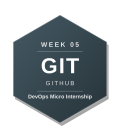
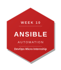

# DevOps Micro Internship with Agentic AI — My Journey

> 👋 **New here?** Read the [submission instructions](./INSTRUCTIONS.md) first — how to fork, fill in, and submit your assignments.

---

## About Me

| | |
|---|---|
| **Name** | Yash Rawat |
| **LinkedIn** | [yash-rawat-linkedin](https://www.linkedin.com/in/yashrawat2362/) |
| **Location** | Faridabad, India |
| **Background** | Cloud, Computer Science Engineering  |
| **Goal** | DevOps Engineer |

---

## About the Program

**DevOps Micro Internship with Agentic AI** is a 15-week mentor-led cohort program by [Pravin Mishra](https://www.linkedin.com/in/pravin-mishra-aws-trainer/) — Cloud, DevOps & AI consultant with 15+ years of experience, 5,000+ learners trained, and 20K+ LinkedIn followers.

This is not a course. It is an internship-style program — real deployments, real pipelines, real evidence reviewed by mentors every week.

- 🌐 Program Website: https://dmi.pravinmishra.com
- 💬 Discord Community: https://discord.pravinmishra.com
- 📺 YouTube: [Pravin Mishra](https://www.youtube.com/@awswithpravinmishra)
- 🔗 Instructor: [LinkedIn](https://www.linkedin.com/in/pravin-mishra-aws-trainer/)

---

## 🏆 Achievements

### Champion of the Week

<!-- If you were named Champion of the Week, add the badge below and link to your LinkedIn post -->

| Week | Award | Post |
|------|-------|------|
| <!-- e.g. Week 03 --> | <!-- 🏆 Champion of the Week --> | <!-- [LinkedIn Post](#) --> |

### Leaderboard

<!-- Add your cohort leaderboard rank here as you progress -->

> 🥇 Cohort 3 Rank: **#__** <!-- Update this each week -->

---

## My DevOps Stack

*Earn a badge each week. To unlock: remove the `<!--` and `-->` from the badge line below.*

*Share your stack:* `https://github.com/YOUR-USERNAME/devops-micro-internship-pravinmishra#my-devops-stack`

**Preview — what your full stack looks like:**

---

**Your stack:**

Week 00 → Internet & Networking Basics

Week 01 → Success Mindset

<!-- Week 02 → Agentic AI with Claude Code -->
<!--  -->

<!-- Week 03 → Linux for DevOps -->
<!--  -->

<!-- Week 04 → Bash Scripting -->
<!--  -->

<!-- Week 05 → Git & GitHub -->
<!--  -->

<!-- Week 06 → DevOps Lifecycle & Agile -->
<!--  -->

<!-- Week 07 → AWS Cloud -->
<!--  -->

<!-- Week 08 → Azure Cloud -->
<!--  -->

<!-- Week 09 → Terraform -->
<!--  -->

<!-- Week 10 → Ansible -->
<!--  -->

<!-- Week 11 → Azure DevOps CI/CD -->
<!--  -->

<!-- Week 12 → Docker -->
<!--  -->

<!-- Week 13 → Kubernetes -->
<!--  -->

<!-- Week 14 → Final Project / Capstone -->
<!--  -->

---

## Program Overview

| Phase | Weeks | Focus |
|-------|-------|-------|
| Foundation | 00 – 02 | Networking, Mindset, Agentic AI |
| Core DevOps | 03 – 06 | Linux, Bash, Git, DevOps Lifecycle |
| Cloud | 07 – 08 | AWS & Azure Real Deployments |
| Automation | 09 – 11 | Terraform, Ansible, CI/CD |
| Containers | 12 – 13 | Docker & Kubernetes |
| Capstone | 14 | Final Project |

---

## Weekly Progress

| Week | Topic | Status | Assignment | LinkedIn Post | Blog Post |
|------|-------|--------|------------|---------------|-----------|
| 00 | Internet & Networking Basics | ✅ Completed | ✅ Solved | — | — |
| 01 | Success Mindset | ✅ Completed | ⏳ Pending | — | — |
| 02 | Agentic AI with Claude Code | ⬜ Not Started | ⏳ Pending | — | — |
| 03 | Linux for DevOps | ⬜ Not Started | ⏳ Pending | — | — |
| 04 | Bash Scripting | ⬜ Not Started | ⏳ Pending | — | — |
| 05 | Git & GitHub | ⬜ Not Started | ⏳ Pending | — | — |
| 06 | DevOps Lifecycle & Agile | ⬜ Not Started | ⏳ Pending | — | — |
| 07 | AWS Cloud | ⬜ Not Started | ⏳ Pending | — | — |
| 08 | Azure Cloud | ⬜ Not Started | ⏳ Pending | — | — |
| 09 | Terraform | ⬜ Not Started | ⏳ Pending | — | — |
| 10 | Ansible | ⬜ Not Started | ⏳ Pending | — | — |
| 11 | Azure DevOps (CI/CD) | ⬜ Not Started | ⏳ Pending | — | — |
| 12 | Docker | ⬜ Not Started | ⏳ Pending | — | — |
| 13 | Kubernetes | ⬜ Not Started | ⏳ Pending | — | — |
| 14 | Final Project | ⬜ Not Started | ⏳ Pending | — | — |

**Status:** ⬜ Not Started &nbsp;|&nbsp; 🔄 In Progress &nbsp;|&nbsp; ✅ Completed 
**Assignment:** ⏳ Pending &nbsp;|&nbsp; ✅ Solved

---

## Certificate of Completion

*Awarded upon completing Week 14 — Final Project.*

<!-- Drop your certificate image here -->

---

## Connect

If you found this repo useful or want to follow my DevOps journey:

- ⭐ Star this repo
- 🔗 Connect with me on [LinkedIn](https://www.linkedin.com/in/yashrawat2362/)
- 🌐 Learn more about the program: https://dmi.pravinmishra.com
- 💬 Join the community: https://discord.pravinmishra.com
