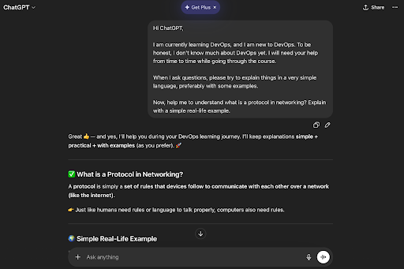
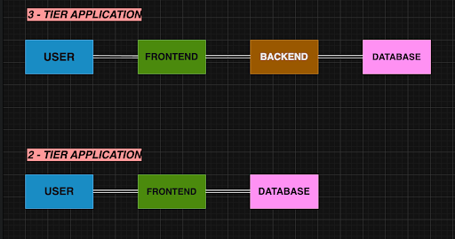
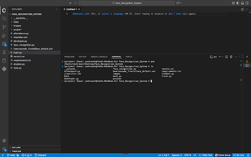

# Week 00 - Internet and Networking

Part of the DevOps Micro Internship (DMI) Cohort 3 with Agentic AI

---

# 🧑‍💻 Task 1: Using ChatGPT as Your Learning Assistant

## Scenario

You're new to DevOps and will frequently encounter technical questions. ChatGPT can be your learning companion.

## Your Task

Write a clear ChatGPT prompt to help you understand:

> "What is a protocol in networking? Explain with a simple real-life example."

Take a screenshot of your interaction showing:

* Your detailed prompt (with clear expectations)
* ChatGPT's simplified response with an example

## Screenshot

Save your screenshot in the `screenshots` folder and update the file name below.




Replace `task-1-chatgpt.png` with your actual screenshot file name.

---

## What I Learned (2–3 lines)

By this task i learnt how to use chatgpt for what i am expecting
By this task I am able to get desired output from the ChatGPT.

---

# 🌐 Task 2: Internet and Networking

## Scenario

Your friend is launching an online bookstore named **EpicReads**.

He asked you to explain how users globally can access his website hosted in Finland.

## Your Task

Write a short explanation (**100–150 words**) that includes:

* Packet Switching
* IP Address
* TCP/IP
* HTTP/HTTPS

💡 **Tip:** You may use ChatGPT (as demonstrated in Task 1) to refine your explanation.

## Answer

Users from anywhere in the world can access the **EpicReads** website because of how the internet sends data using networking technologies. When a user types the website URL, their device first finds the server’s **IP address**, which is a unique numerical identity of the server hosted in Finland. The data is then sent using **packet switching**, where information is broken into small packets and travels through different network paths before reaching the server.
Communication happens through the **TCP/IP** protocol suite — TCP ensures all packets arrive correctly and in order, while IP handles addressing and routing. Finally, the website content is delivered using **HTTP or HTTPS**. HTTPS is more secure because it encrypts the data, protecting user information like login details or payments. This whole process allows smooth global access to the website.

---

# 🏗️ Task 3: Application Architecture & Stack

## Scenario

EpicReads bookstore has two application versions:

### Two-Tier Application

* Frontend
* Database

### Three-Tier Application

* Frontend
* Backend
* Database

## Your Task

* Draw simple diagrams (hand-drawn or tool-based such as draw.io)
* Label each layer clearly
* List at least two common technologies or tools used for each layer
* Submit a screenshot or photo clearly showing your own drawing

## Diagram Screenshot / Photo

Save your diagram image in the `screenshots` folder and update the file name below.




Replace `task-3-diagram.png` with your actual diagram file name.

---

## Technologies Used

### Frontend

Next.js
Tail Wind css

### Backend

Node.js
Python

### Database

MySQL
MongoDB

---

# 🌍 Task 4: Domain Name & DNS (Basic Concepts)

## Scenario

Your friend's bookstore **EpicReads** is currently accessible through:

```text
52.172.142.222:3000
```

He purchased the domain:

```text
epicreads.com
```

## Your Task

In **50–100 words**, explain in your own words:

1. What is DNS (Domain Name System)?
2. Which DNS record type should be used to connect the domain to the given IP, and why?

## Answer

**DNS (Domain Name System)** is like the internet’s phonebook. It converts a human-friendly domain name like **epicreads.com** into a machine-friendly **IP address (52.172.142.222)** so that browsers can find and open the correct server hosting the website.

To connect the domain to this IP, an **A record (Address Record)** should be used. This is because an A record directly maps a domain name to an **IPv4 address**, allowing users to access the EpicReads website using the domain instead of typing the numeric IP.

---

# 💻 Task 5: Visual Studio Code Setup (Hands-on)

## Your Task

Install Visual Studio Code (if not already installed).

Take a screenshot of your VS Code environment showing:

* Terminal open inside VS Code
* Running a basic command:

### Windows

```powershell
dir
```

### Linux / macOS

```bash
pwd
ls
```

* Your selected VS Code theme clearly visible

⚠️ **Important:** The screenshot must show your username or another identifiable detail to confirm it is your environment.

## Screenshot

Save your screenshot in the `screenshots` folder and update the file name below.




Replace `task-5-vscode.png` with your actual screenshot file name.

---

# 🔗 Task 6: Publish Your Assignment as a LinkedIn Post

## Objective

Publishing on LinkedIn helps you:

* Build your professional online presence
* Reinforce your learning
* Document your DevOps journey publicly

## Your Task

Summarize your answers from Tasks 1–5 into a LinkedIn post.

Clearly structure your post into the following sections:

* ChatGPT
* Internet & Networking
* App Architecture
* DNS
* VS Code Setup

Add the following credit note at the end of your post:

> **P.S. This post is part of the DevOps Micro Internship (DMI) with Agentic AI — Cohort 3 — by Pravin Mishra. My graded progress is public: https://dmi.pravinmishra.com/s/YOUR-GITHUB-USERNAME.html · Start your DevOps journey: https://dmi.pravinmishra.com/?utm_source=student&utm_medium=ps-linkedin&utm_campaign=cohort3**

---

## LinkedIn Post URL

Paste your LinkedIn post URL here: 

```text
https://www.linkedin.com/posts/yashrawat2362_devops-devopsjourney-learninginpublic-activity-7442653732573704192-1YVd?utm_source=share&utm_medium=member_desktop&rcm=ACoAADkdLvUBSPhBiWFg4xDHAf9vp3Ws4aR12mQ
```

---

## LinkedIn Post Backup Copy

Paste the full text of your LinkedIn post here:

🚀 Starting My DevOps Journey – Learning & Building Step by Step
I have recently started learning DevOps, and here are some key tasks I have completed so far:

🤖 ChatGPT
Used ChatGPT as a learning assistant to understand DevOps and networking concepts in a simple and practical way.

🌐 Internet & Networking
Learned how the internet works using concepts like packet switching, IP address, TCP/IP, and HTTP/HTTPS, and how users globally can access a hosted website.

🏗️ App Architecture
Understood the difference between Two-Tier (Frontend + Database) and Three-Tier (Frontend + Backend + Database) architectures along with common technologies used in each layer.

📡 DNS
Learned about DNS (Domain Name System) and how an A Record connects a domain name to a server’s IPv4 address.

💻 VS Code Setup
Installed and configured VS Code as a development environment for learning and practicing DevOps tools and workflows.

✨ Excited to continue this journey and build real-world skills!

#DevOps #DevOpsJourney #LearningInPublic #TechLearning #NetworkingBasics #WebArchitecture #DNS #CloudComputing #SoftwareEngineering #BeginnerToPro #FutureEngineer #Upskilling #TechCareer

P.S. This post is part of the FREE DevOps Micro Internship Cohort run by Pravin Mishra. You can start your DevOps journey for free from his YouTube Playlist https://lnkd.in/gu2Dyepa


---

# Reflection – Week 0

### What did you find easy?

I found it easy to understand the basic concepts of the Internet, such as DNS, IP addresses, HTTP/HTTPS, and how a request travels from a browser to a web server. The diagrams and real-world examples made these topics easier to follow.

---

### What was difficult?

At first, it was a little confusing to understand how all the networking components work together. Connecting concepts like DNS, TCP/IP, packets, and client-server communication took some time, but it became much clearer after practicing and revising.

---

### What will you improve next week?

Next week, I want to spend more time practicing the concepts instead of just reading them. I'll take notes, ask more questions, and focus on building a stronger foundation before moving on to advanced DevOps topics.

---

## 📌 About DMI & CloudAdvisory

DevOps Micro Internship (DMI) is a project-based DevOps program run by Pravin Mishra (The CloudAdvisory) focused on real-world execution, systems thinking, and career readiness.

It helps learners build strong DevOps foundations with hands-on experience.


## 📌 Resources

- 🌐 **DMI Official Website:** https://dmi.pravinmishra.com?utm_source=github&utm_medium=readme  
- 🎓 **University:** https://university.pravinmishra.com?utm_source=github&utm_medium=readme  
- 💬 **Discord Community:** https://discord.pravinmishra.com?utm_source=github&utm_medium=readme  
- 📝 **Blog:** https://dmi.pravinmishra.com/blog?utm_source=github&utm_medium=readme  
- ▶️ **YouTube Playlist (DMI Cohort 3):** https://www.youtube.com/playlist?list=PLFeSNDtI4Cho  
- 🔗 **Pravin Mishra (LinkedIn):** https://www.linkedin.com/in/pravin-mishra-aws-trainer/  
- 🏢 **CloudAdvisory (LinkedIn):** https://www.linkedin.com/company/thecloudadvisory/

---

*This submission is part of DevOps Micro Internship (DMI) Cohort 3 — Agentic AI Track*
