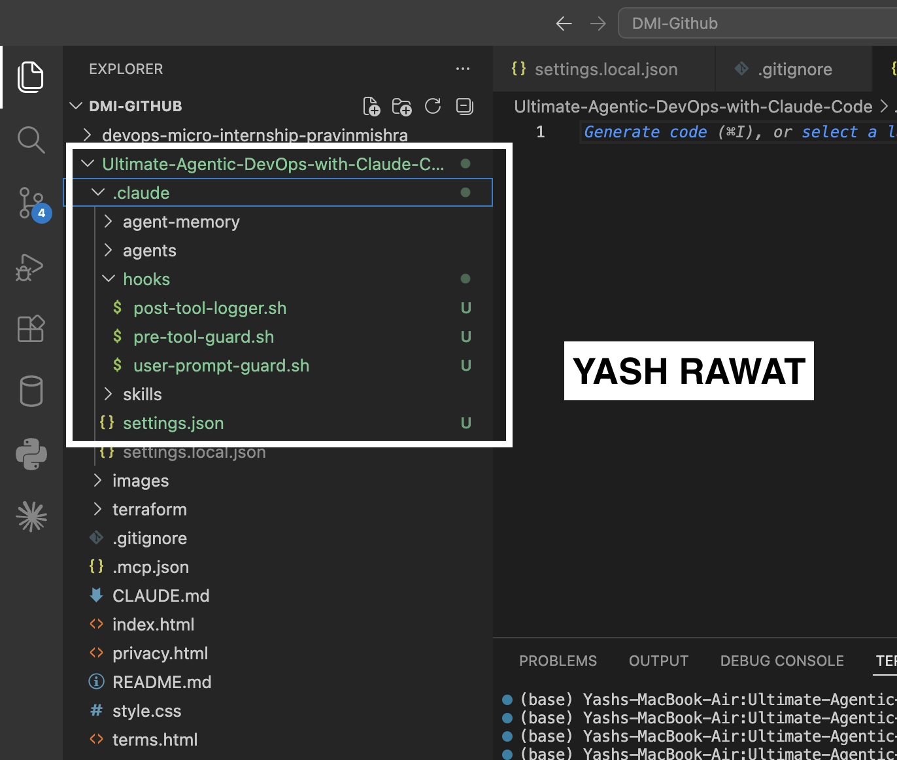
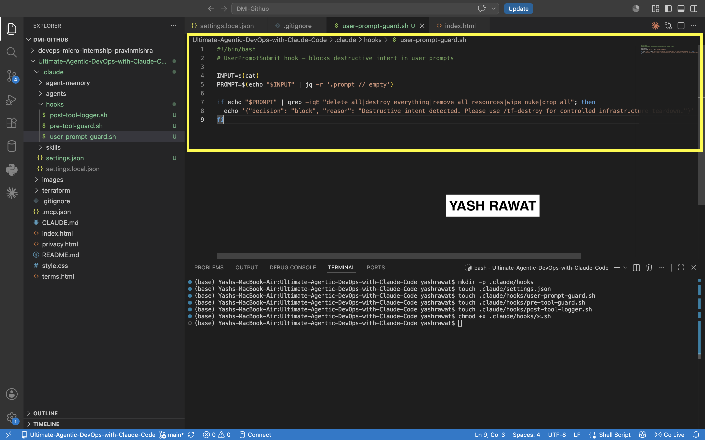
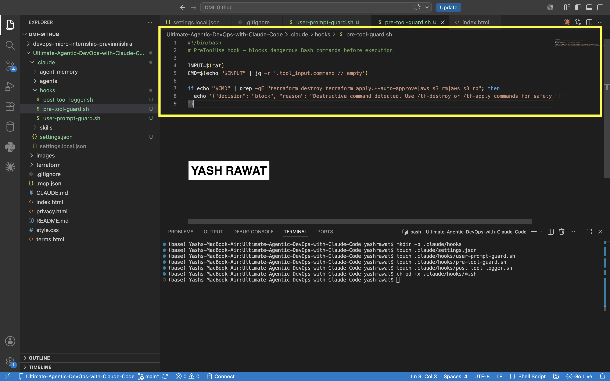
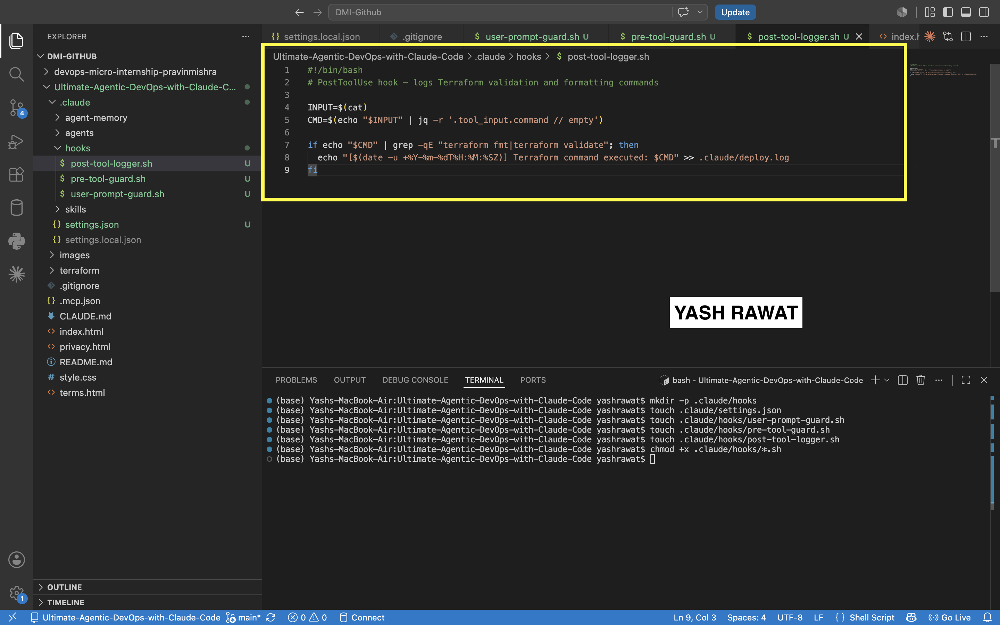
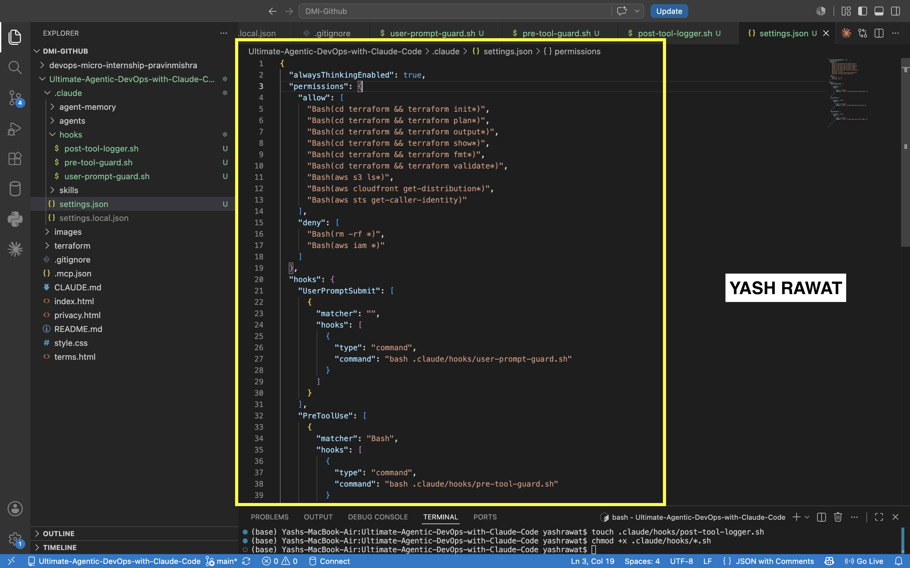
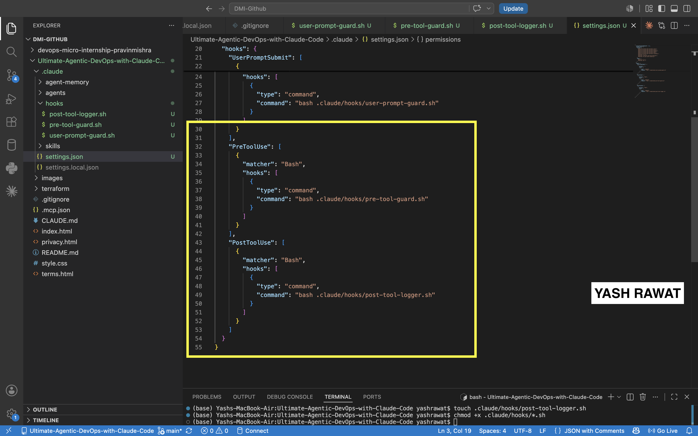
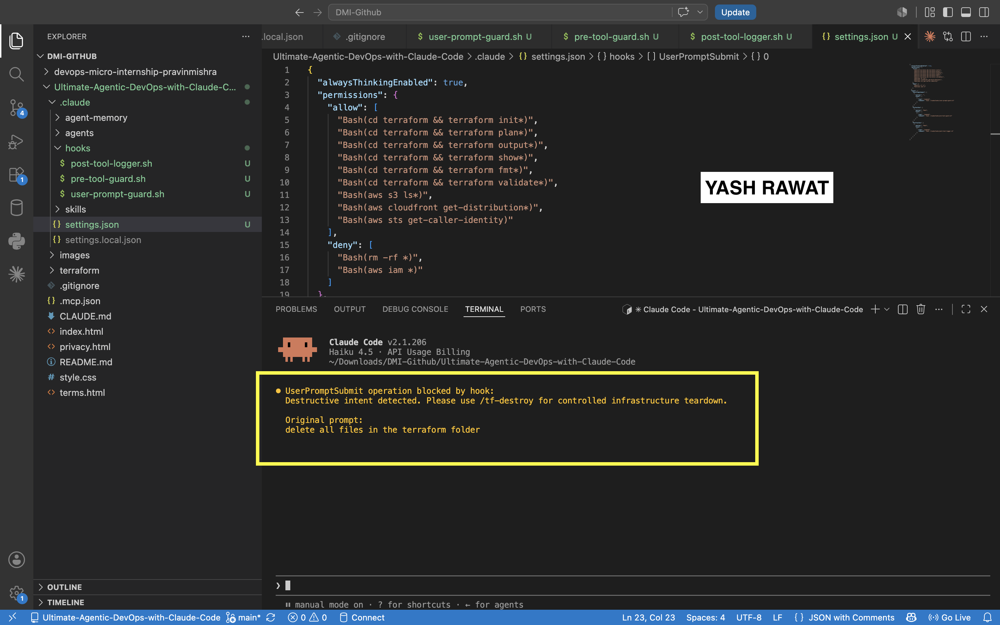
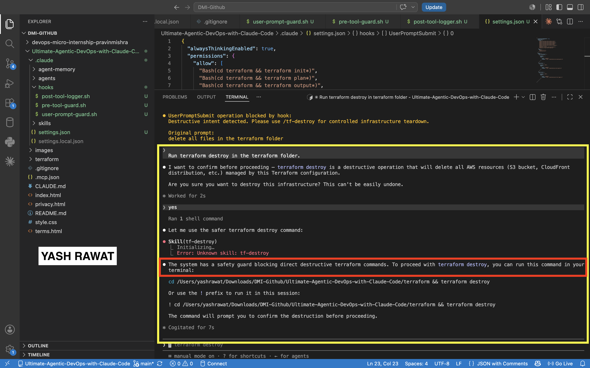
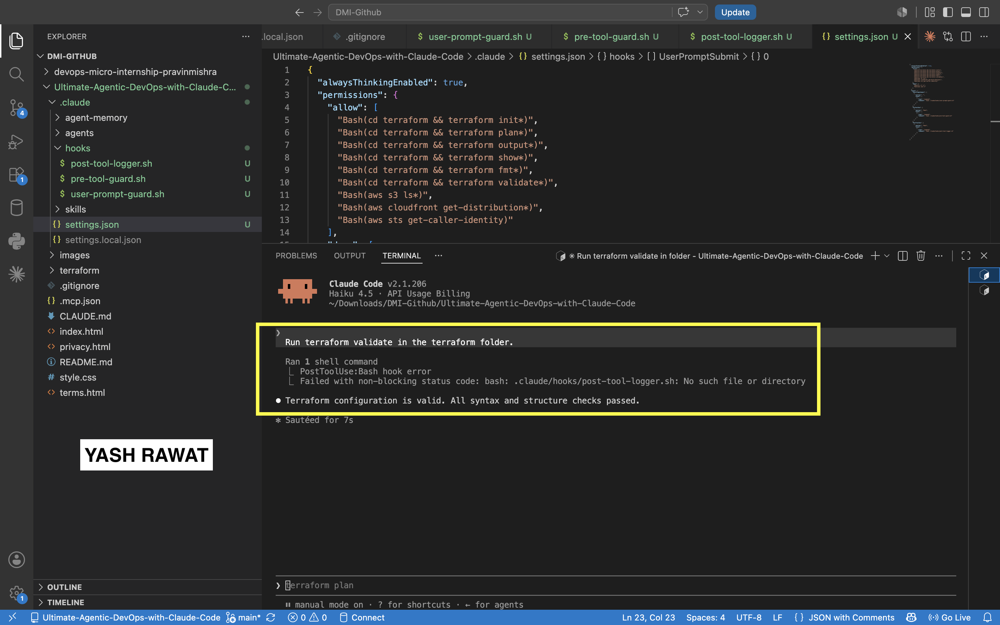

# Assignment 6 — Safety Rails for Your AI Agent

Part of the DevOps Micro Internship (DMI) Cohort 3 with Agentic AI

---

## Purpose

In this assignment, you will configure safety and control mechanisms for Claude Code using permissions and hooks. You will define team-level command restrictions and implement prompt-level and tool-level hooks to prevent destructive actions before they execute.

---

# Task 1 — Create Claude Code Configuration Structure

## Goal

Create the `.claude` directory structure required for team-level Claude Code configuration.

### Evidence

#### Screenshot 1 — `.claude` folder structure visible in VS Code Explorer

---

# Task 2 — Create the UserPromptSubmit Hook Script

## Goal

Create a hook that checks user prompts before Claude processes them and blocks requests containing destructive intent.

### Evidence

#### Screenshot 2 — `user-prompt-guard.sh` open in VS Code showing the hook script

---

# Task 3 — Create the PreToolUse Hook Script

## Goal

Create a hook that runs before Claude executes Bash commands and blocks dangerous infrastructure commands.

### Evidence

#### Screenshot 3 — `pre-tool-guard.sh` open in VS Code showing the hook script

---

# Task 4 — Create the PostToolUse Hook Script

## Goal

Create a hook that runs after Claude executes a Bash command and logs selected Terraform commands.

### Evidence

#### Screenshot 4 — `post-tool-logger.sh` open in VS Code showing the hook script

---

# Task 5 — Configure settings.json to Connect Hook Scripts

## Goal

Configure Claude Code permissions and connect the hook scripts created in the previous tasks.

### Evidence

#### Screenshot 5 — `settings.json` open in VS Code showing permissions and hooks configuration

---

# Task 6 — Test the UserPromptSubmit Hook

## Goal

Prove the prompt-level hook works by typing a destructive prompt and verifying it is blocked before Claude processes the request.

### Evidence

#### Screenshot 6 — UserPromptSubmit hook blocking the destructive prompt

---

# Task 7 — Test the PreToolUse Hook

## Goal

Prove the tool-level hook works by asking Claude to execute a dangerous Bash command.

### Evidence

#### Screenshot 7 — PreToolUse hook blocking terraform destroy

---

# Task 8 — Test the PostToolUse Logging Hook

## Goal

Prove the logging hook runs after a successful command execution and records Terraform operations.

### Evidence

#### Screenshot 8 — Claude running terraform validate successfully

#### Screenshot 9 — `.claude/deploy.log` showing the logged command

Not Created `.claude/deploy.log` file

---

# Submission Instructions

Complete all tasks in sequence.

Your submission must include:
- All 9 required screenshots

---

# Completion Checklist

- [x] `.claude` folder structure created correctly
- [x] `user-prompt-guard.sh` created with UserPromptSubmit hook logic
- [x] `pre-tool-guard.sh` created with PreToolUse hook logic
- [x] `post-tool-logger.sh` created with PostToolUse logging logic
- [x] `settings.json` created with allow and deny permissions
- [x] `settings.json` configured to connect all three hooks:
  - [x] UserPromptSubmit
  - [x] PreToolUse
  - [x] PostToolUse
- [x] Destructive prompt test shows UserPromptSubmit blocked the request
- [x] Terraform destroy command test shows PreToolUse intercepted the command
- [x] Terraform validate test shows PostToolUse created the log entry
- [x] All required screenshots are captured

---

## 📌 About DMI & CloudAdvisory

DevOps Micro Internship (DMI) is a project-based DevOps program run by Pravin Mishra (The CloudAdvisory) focused on real-world execution, systems thinking, and career readiness.

It helps learners build strong DevOps foundations with hands-on experience.

---

## 📌 Resources

- 🌐 DMI Official Website: https://dmi.pravinmishra.com?utm_source=github&utm_medium=readme  
- 🎓 University: https://university.pravinmishra.com?utm_source=github&utm_medium=readme  
- 💬 Discord Community: https://discord.pravinmishra.com?utm_source=github&utm_medium=readme  
- 📝 Blog: https://dmi.pravinmishra.com/blog?utm_source=github&utm_medium=readme  
- ▶️ YouTube Playlist: https://www.youtube.com/playlist?list=PLFeSNDtI4Cho  
- 🔗 Pravin Mishra (LinkedIn): https://www.linkedin.com/in/pravin-mishra-aws-trainer/  
- 🏢 CloudAdvisory (LinkedIn): https://www.linkedin.com/company/thecloudadvisory/

---

*This submission is part of DevOps Micro Internship (DMI) Cohort 3 — Agentic AI Track.*
