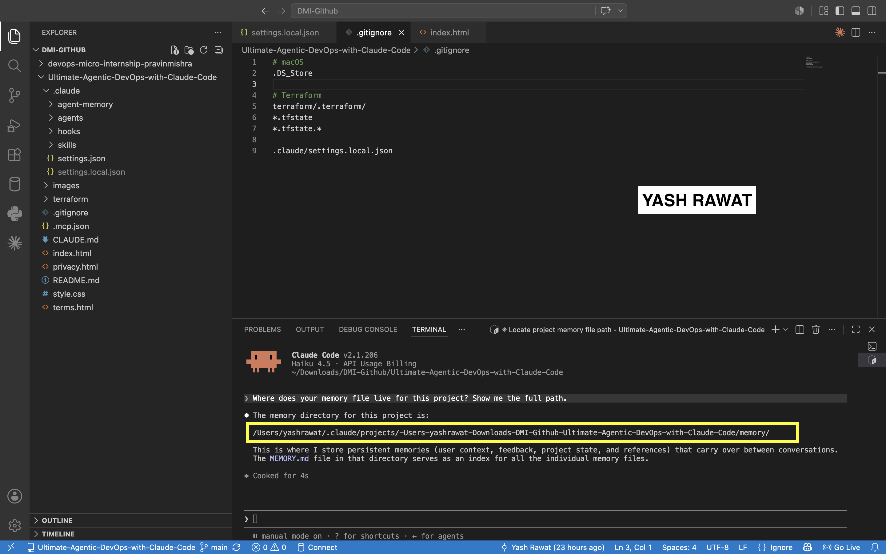
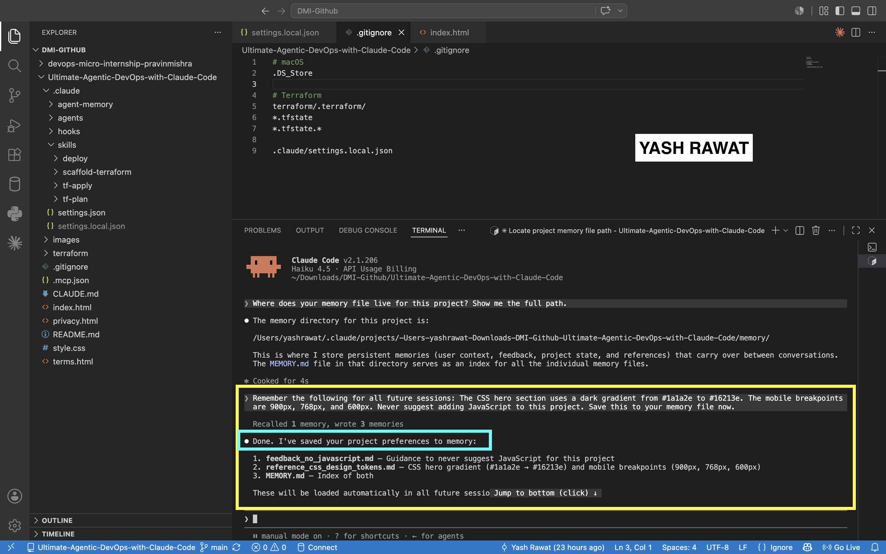
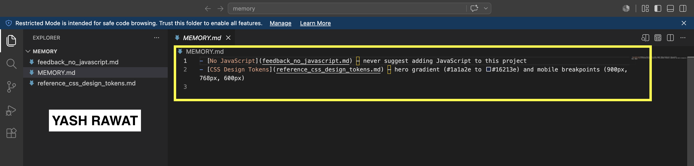
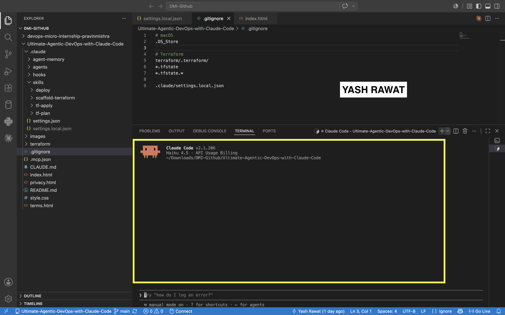
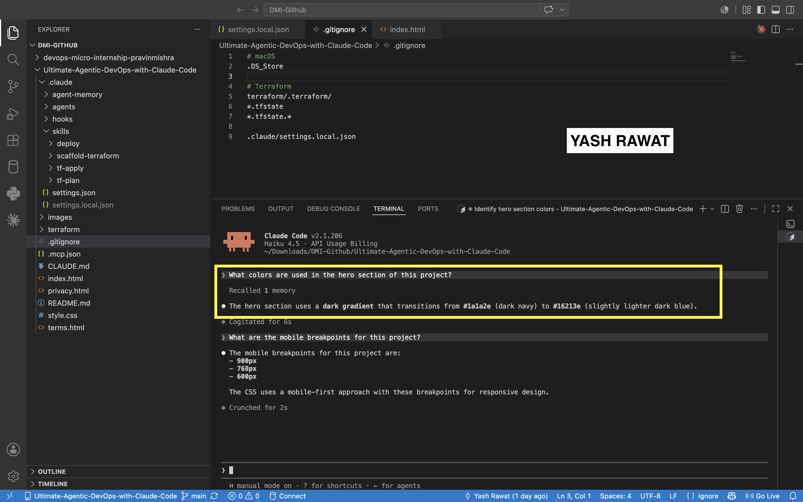
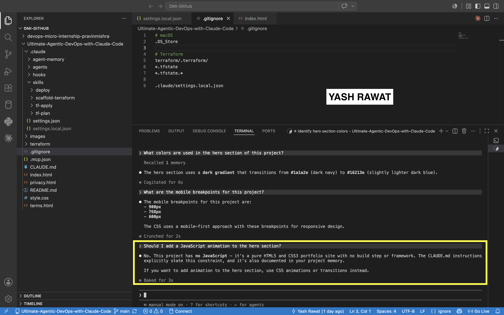

# Assignment 7 — A Claude That Remembers

Part of the DevOps Micro Internship (DMI) Cohort 3 with Agentic AI

---

## Purpose

In this assignment, you will explore Claude Code’s memory system. You will locate the project memory file, store structured information into it, restart your session, and verify that Claude can recall stored knowledge across sessions without being prompted again.

---

# Task 1 — Find the Memory File Location

## Goal

Discover exactly where Claude Code stores memory for this project.

### Evidence

#### Screenshot 1 — Memory file path shown by Claude

---

# Task 2 — Give Claude Information to Remember

## Goal

Teach Claude three specific facts about the project and instruct it to save them to the memory file.

### Evidence

#### Screenshot 2 — Claude confirming the memory was saved

---

#### Screenshot 3 — The `MEMORY.md` file open in VS Code showing the saved content

---

# Task 3 — Close the Session Completely

## Goal

Terminate the current Claude Code session and restart it to ensure memory is the only persistent context source.

### Evidence

#### Screenshot 4 — VS Code reopened with a fresh Claude Code session showing no previous conversation

---

# Task 4 — Prove Memory Recall Across Sessions

## Goal

Run three tests that prove Claude remembers what you told it — without you saying it again in the new session.

### Evidence

#### Screenshot 5 — Claude recalling hero section colors

---

#### Screenshot 6 — Claude refusing JavaScript request based on memory rule

---

# Submission Instructions

- Ensure memory was successfully saved into `MEMORY.md`
- Restart Claude Code session completely before testing recall
- Add all required screenshots to your GitHub repository
- Push final changes to your forked repository

---

## Linkedin Post Link

Paste your Linkedin post link here:

<<<<<<< HEAD:week-02-agentic-ai/solution-assignment-07-memory.md
`https://www.linkedin.com/posts/yashrawat2362_dmibypravinmishra-agenticai-claudecode-ugcPost-7481454941941899265--863/?utm_source=share&utm_medium=member_desktop&rcm=ACoAADkdLvUBSPhBiWFg4xDHAf9vp3Ws4aR12mQ`
=======
`Add your URL here`
>>>>>>> upstream/main:week-02-agentic-ai/assignment-07-memory.md

---

## GitHub Repository URL

Paste your forked repository URL here:

<<<<<<< HEAD:week-02-agentic-ai/solution-assignment-07-memory.md
`https://github.com/yashrawat2362/Ultimate-Agentic-DevOps-with-Claude-Code`
=======
`Add your URL here`
>>>>>>> upstream/main:week-02-agentic-ai/assignment-07-memory.md

---

# Completion Checklist

- [✓] Memory file path identified (Screenshot 1)
- [✓] Memory successfully saved via prompt (Screenshot 2)
- [✓] `MEMORY.md` shows stored content (Screenshot 3)
- [✓] Fresh session opened after full restart (Screenshot 4)
- [✓] Claude recalled hero colors correctly (Screenshot 5)
- [✓] Claude refused JavaScript request based on memory (Screenshot 6)
- [✓] All screenshots added and committed to GitHub repo
- [✓] Linkedin post created.

---

## 📌 About DMI & CloudAdvisory

DevOps Micro Internship (DMI) is a project-based DevOps program run by Pravin Mishra (The CloudAdvisory) focused on real-world execution, systems thinking, and career readiness.

It helps learners build strong DevOps foundations with hands-on experience.

---

## 📌 Resources

- 🌐 DMI Official Website: https://pravinmishra.com/dmi  
- 🎓 DevOps for Beginners (Udemy): https://www.udemy.com/course/devops-for-beginners-docker-k8s-cloud-cicd-4-projects/  
- 🎓 Agentic AI DevOps with Claude Code: https://www.udemy.com/course/ultimate-agentic-ai-devops-with-claude-code/  
- 🎓 DevOps with Claude Code: Terraform, EKS, ArgoCD & Helm: https://www.udemy.com/course/devops-with-claude-code-terraform-eks-argocd-helm/  
- ▶️ YouTube Playlist: https://www.youtube.com/playlist?list=PLFeSNDtI4Cho  
- 🔗 Pravin Mishra (LinkedIn): https://www.linkedin.com/in/pravin-mishra-aws-trainer/  
- 🏢 CloudAdvisory (LinkedIn): https://www.linkedin.com/company/thecloudadvisory/

---

*This submission is part of DevOps Micro Internship (DMI) Cohort 3 — Agentic AI Track.*