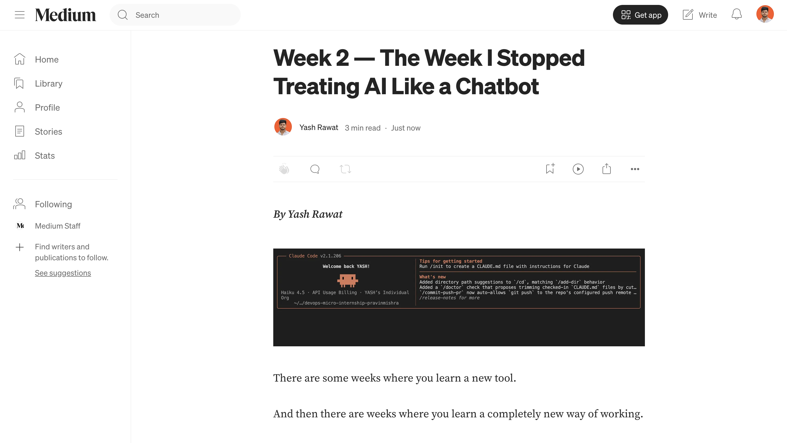
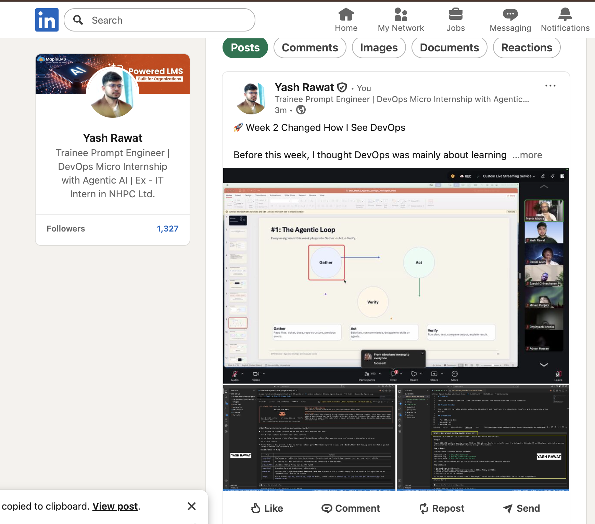

# Assignment 8 — Week 2 Reflection Blog

Part of the DevOps Micro Internship (DMI) Cohort 3 with Agentic AI

---

# Purpose

In this assignment, you will reflect on your Week 2 learning journey and write a short blog capturing your experience working with Agentic AI tools such as Claude Code, Skills, Subagents, MCP, Hooks, Permissions, and Memory.

You will also publish a LinkedIn post summarizing your learning and share both links for evaluation.

---

# Task 1 — Write Your Reflection Blog

## Goal

Write a reflection blog covering your Week 2 learning experience.

### Blog Requirements

Your blog must include:

* Title: **Reflection – Week 2**
* Minimum 300 words
* At least 2–3 topics from Week 2 (Claude Code, Skills, Subagents, MCP, Hooks, Permissions, Memory)
* Honest personal reflection (learning, challenges, mindset)
* One habit/system you plan to implement
* Your full name clearly visible

### Allowed Platforms

You can publish your blog on:

* Hashnode
* Medium
* Dev.to
* LinkedIn Article
* GitHub Markdown file
* Substack

---

### Evidence

#### Screenshot 1 — Blog published and visible



---

### Submission Field

Blog Link:

<<<<<<< HEAD:week-02-agentic-ai/solution-assignment-08-Week-2-reflection.md
`https://medium.com/@yashrawat2362/week-2-the-week-i-stopped-treating-ai-like-a-chatbot-7aa73974450c`
=======
`https://medium.com/@yashrawat2362/week-2-the-week-i-stopped-treating-ai-like-a-chatbot-7aa73974450c`
>>>>>>> upstream/main:week-02-agentic-ai/assignment-08-week-2-reflection.md

---

# Task 2 — Create LinkedIn Post

## Goal

Share your Week 2 learning publicly on LinkedIn.

---

### LinkedIn Post Requirements

Your post must include:

* One screenshot from any Week 2 assignment
* Short reflection (what you learned or built)
* Required P.S. line exactly as given below

---

### Required P.S. Line (Must Include Exactly)

> **P.S. This post is part of the DevOps Micro Internship (DMI) with Agentic AI — Cohort 3 — by [Pravin Mishra](https://www.linkedin.com/in/pravin-mishra-aws-trainer/). My graded progress is public: https://dmi.pravinmishra.com/s/YOUR-GITHUB-USERNAME.html · Start your DevOps journey: https://dmi.pravinmishra.com/?utm_source=student&utm_medium=ps-linkedin&utm_campaign=cohort3**

---

### Suggested Hashtags

#DMIByPravinMishra #AgenticAI #ClaudeCode #DevOps #LearningInPublic

---

### Evidence

#### Screenshot 2 — LinkedIn post published



---

### Submission Field

LinkedIn Post Content (copy-paste here):

```
🚀 Week 2 Changed How I See DevOps

Before this week, I thought DevOps was mainly about learning tools.

Terraform.
AWS.
GitHub Actions.
Docker.

I believed the goal was to memorize commands and write configuration files.
Week 2 completely changed that mindset.

I realized modern DevOps isn't about writing more code—it's about building better systems.

Instead of manually creating Terraform files, repeating the same YAML configurations, or solving the same deployment problems over and over, I learned how Agentic AI can automate repetitive work while keeping the engineer in control.

One idea really stood out to me:

**AI shouldn't replace engineers. It should eliminate repetitive work so engineers can focus on better decisions.**

During Week 2, I explored concepts that felt like building an AI-powered engineering team:

🧠 Teaching AI to understand a project with CLAUDE.md
⚡ Creating reusable DevOps skills with slash commands
👥 Building specialized AI agents for security, cost optimization, Terraform, and drift detection
🔌 Connecting AI to real tools using MCP
🛡️ Protecting infrastructure with hooks and permissions
💾 Enabling memory so AI remembers project decisions across sessions

The most exciting part wasn't that AI generated code.

It was seeing how all these pieces work together to create a repeatable, production-ready workflow.

This week changed the question I ask myself.

Instead of...

"How do I write this configuration?"

I now think...

"How can I build a system that solves this problem every time?"

That's a mindset I'll carry into every project I build from now on.

Pravin Mishra, Anjana Muthunayake (Lead Co-Mentor), Nkechi Anna Ahanonye, Tanisha Borana, Anuradha Iyer (Group Co-Mentors)

P.S. This post is a part of DevOps Micro Internship with Agentic AI Cohort-3 by Pravin Mishra. You can start your DevOps journey by joining this Discord community ( https://lnkd.in/gzJrEt7f ).

#DMIByPravinMishra #AgenticAI #ClaudeCode #DevOps #LearningInPublic
```

---

### LinkedIn Post Link:

<<<<<<< HEAD:week-02-agentic-ai/solution-assignment-08-Week-2-reflection.md
`https://www.linkedin.com/posts/yashrawat2362_dmibypravinmishra-agenticai-claudecode-activity-7481464850292895744-NO__?utm_source=share&utm_medium=member_desktop&rcm=ACoAADkdLvUBSPhBiWFg4xDHAf9vp3Ws4aR12mQ`
=======
`https://www.linkedin.com/posts/yashrawat2362_dmibypravinmishra-agenticai-claudecode-activity-7481464850292895744-NO__?utm_source=share&utm_medium=member_desktop&rcm=ACoAADkdLvUBSPhBiWFg4xDHAf9vp3Ws4aR12mQ`
>>>>>>> upstream/main:week-02-agentic-ai/assignment-08-week-2-reflection.md

---

# Submission Instructions

* Blog must be publicly accessible
* LinkedIn post must be visible (public or unlisted where applicable)
* All required fields must be filled
* Screenshot proofs must be added to GitHub repository
* Do not include sensitive information in blog or post

---

# Completion Checklist

* [x] Blog written with required structure
* [x] Blog includes at least 2–3 Week 2 topics
* [x] Blog is publicly accessible
* [x] LinkedIn post created
* [x] Required P.S. line included
* [x] LinkedIn post content copied in submission field
* [x] Blog link added
* [x] LinkedIn post link added
* [x] Screenshots added to GitHub repo

---

# About DMI & CloudAdvisory

DevOps Micro Internship (DMI) is a project-based DevOps program run by Pravin Mishra (The CloudAdvisory), focused on real-world execution, systems thinking, and agentic AI workflows.

It helps learners build strong DevOps foundations through hands-on experience.

---

# Resources

* 🌐 DMI Official Website: [https://dmi.pravinmishra.com?utm_source=github&utm_medium=readme](https://dmi.pravinmishra.com?utm_source=github&utm_medium=readme)
* 🎓 University: [https://university.pravinmishra.com?utm_source=github&utm_medium=readme](https://university.pravinmishra.com?utm_source=github&utm_medium=readme)
* 💬 Discord Community: [https://discord.pravinmishra.com?utm_source=github&utm_medium=readme](https://discord.pravinmishra.com?utm_source=github&utm_medium=readme)
* 📝 Blog: [https://dmi.pravinmishra.com/blog?utm_source=github&utm_medium=readme](https://dmi.pravinmishra.com/blog?utm_source=github&utm_medium=readme)
* ▶️ YouTube Playlist: [https://www.youtube.com/playlist?list=PLFeSNDtI4Cho](https://www.youtube.com/playlist?list=PLFeSNDtI4Cho)
* 🔗 Pravin Mishra (LinkedIn): [https://www.linkedin.com/in/pravin-mishra-aws-trainer/](https://www.linkedin.com/in/pravin-mishra-aws-trainer/)
* 🏢 CloudAdvisory (LinkedIn): [https://www.linkedin.com/company/thecloudadvisory/](https://www.linkedin.com/company/thecloudadvisory/)

