# Assignment 5 — Bash Script Automation Drill (OPS Checklist)

Part of the DevOps Micro Internship (DMI) Cohort 3 with Agentic AI

---

## Purpose

In this assignment, you will practice Bash scripting by building a series of small automation scripts covering environment setup, variables, arrays, loops, file conditionals, if-else logic, and functions. These scripts form the foundation of real-world Linux automation used in DevOps, cloud, and production support environments.

---

# Task 1 — Bash Environment & Workspace Setup

## Goal

Verify that Bash is available on your system and create a clean workspace for this assignment.

### Evidence

#### Screenshot 1 — Output of `echo $SHELL` and `bash --version`

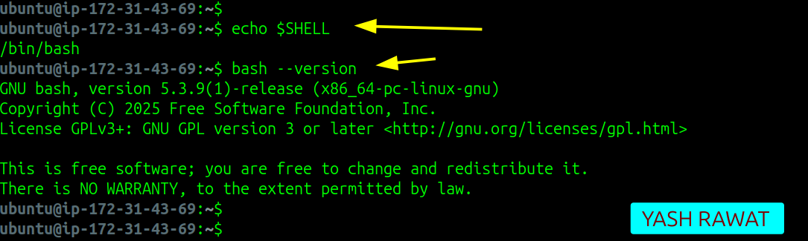

---

#### Screenshot 2 — Output of `pwd` and `ls -lah` showing the scripts directory

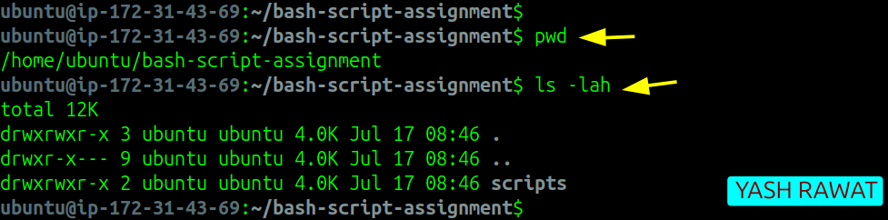

---

### Notes

Answer the following in your own words:

**1. What is Bash?**

Bash is a command-line interpreter that lets us interact with the Linux operating system. It allows us to run commands, create scripts, and automate repetitive tasks, making system administration easier.

---

**2. What is the difference between shell and Bash?**

A shell is a program that allows users to communicate with the operating system. Bash is one type of shell and is the most commonly used shell on Linux. In simple words, Bash is a specific shell with many useful features for scripting and automation.

---

**3. Why is it important to confirm the Bash version before writing scripts?**

Checking the Bash version helps ensure that the features used in the script are supported. Different versions may behave differently, so verifying the version helps avoid compatibility issues and unexpected errors while running the script.

---

# Task 2 — Your First Bash Script

## Goal

Create your first Bash script, make it executable, and run it from the terminal.

### Evidence

#### Screenshot 1 — Content of `first-script.sh`

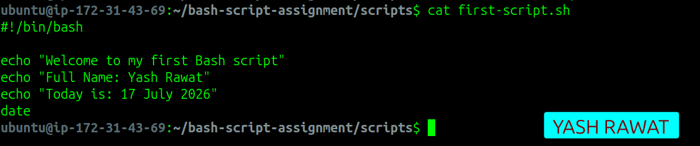

---

#### Screenshot 2 — Output of `./first-script.sh`

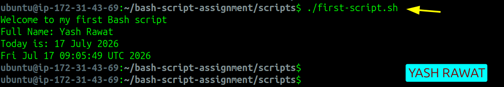

---

#### Screenshot 3 — Output of `ls -l first-script.sh` showing executable permission

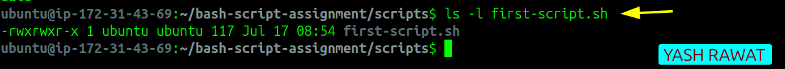

---

### Notes

Answer the following in your own words:

**1. What is the purpose of `#!/bin/bash`?**

The #!/bin/bash line tells the system to run the script using the Bash interpreter. It ensures the script is executed with Bash, even if another shell is the default.

---

**2. Why do we use `chmod +x` before running a script?**

We use chmod +x to make the script executable. Without this permission, the system will not allow the script to run directly.

---

**3. What is the difference between running a script using `./script.sh` and `bash script.sh`?**

./script.sh runs the script as an executable file, so it needs execute permission (chmod +x). bash script.sh runs the script using the Bash interpreter directly, so it works even if the script is not executable.

---

# Task 3 — Variables: User Information Script

## Goal

Use variables to store and display user-related information.

### Evidence

#### Screenshot 1 — Content of `user-info.sh`

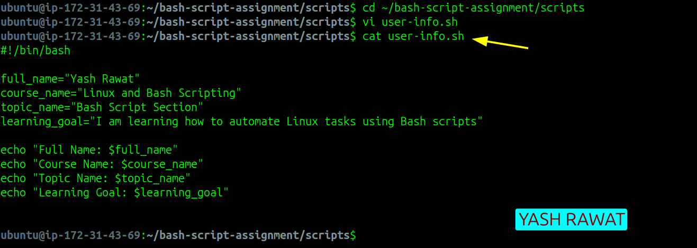

---

#### Screenshot 2 — Output of `./user-info.sh`

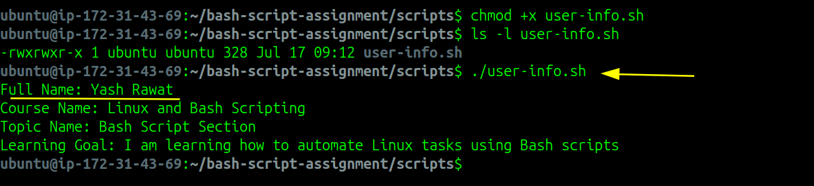

---

### Notes

Answer the following in your own words:

**1. What is a variable in Bash?**

A variable in Bash is used to store information, such as text or numbers, that can be used later in the script. It makes scripts easier to read and update.

---

**2. Why should we avoid spaces around the `=` sign when creating variables?**

Bash does not allow spaces around the = sign when assigning a value to a variable. If spaces are added, Bash treats it as a command instead of a variable assignment, which causes an error.

---

**3. How do you access the value stored inside a Bash variable?**

We use the $ symbol before the variable name to access its value. For example, if the variable is name, we use $name to print or use its stored value.

---

# Task 4 — Arrays & Loops: Tools Checklist Script

## Goal

Use arrays and loops to print a checklist of tools used in Bash scripting.

### Evidence

#### Screenshot 1 — Content of `tools-checklist.sh`

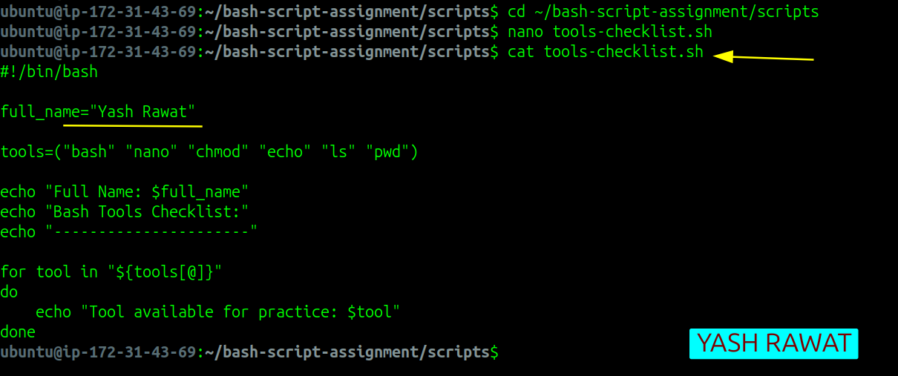

---

#### Screenshot 2 — Output of `./tools-checklist.sh`

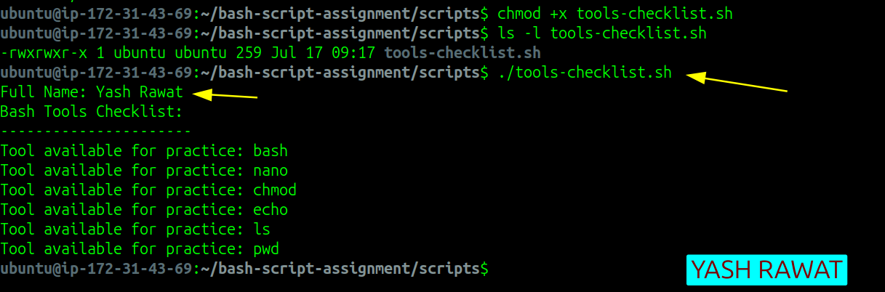

---

### Notes

Answer the following in your own words:

**1. What is an array in Bash?**

An array in Bash is a variable that can store multiple values under one name. It helps keep related data together and makes scripts easier to manage.

---

**2. Why are arrays useful in scripts?**

Arrays are useful because they let us store and work with multiple values without creating many separate variables. This makes the script shorter, cleaner, and easier to update.

---

**3. What does `"${tools[@]}"` mean?**

"${tools[@]}" means all the values stored in the tools array. It allows the script to access each item in the array one by one.

---

**4. What is the purpose of the `for` loop in this script?**

The for loop goes through each item in the tools array and prints it. It helps repeat the same task automatically without writing the same code multiple times.

---

# Task 5 — Loops: Number Counter Script

## Goal

Use loops to repeat a task multiple times.

### Evidence

#### Screenshot 1 — Content of `counter.sh`

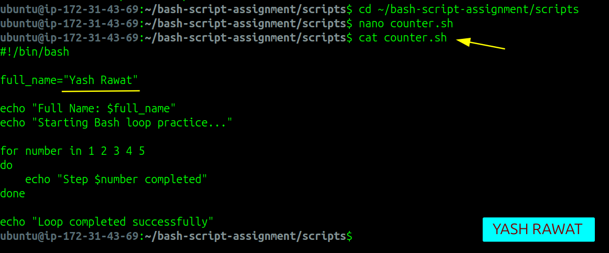

---

#### Screenshot 2 — Output of `./counter.sh`

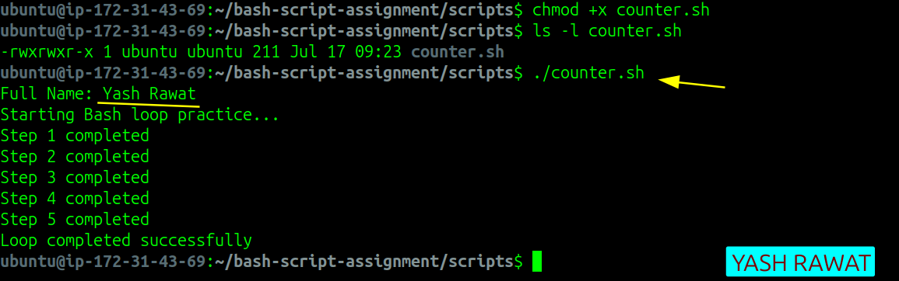

---

### Notes

Answer the following in your own words:

**1. What is a loop?**

A loop is a programming structure that repeats a set of commands multiple times. It helps perform the same task automatically without writing the code again and again.

---

**2. Why do we use loops in Bash scripting?**

We use loops to automate repetitive tasks. They make scripts shorter, save time, and reduce the chances of making mistakes.

---

**3. How many times did the loop run in your script?**

The loop ran 5 times, printing the numbers from 1 to 5.

---

**4. What would you change if you wanted the loop to run 10 times?**

I would update the loop to include numbers from 1 to 10. For example:
`for number in {1..10}`
or
`for number in 1 2 3 4 5 6 7 8 9 10`

---

# Task 6 — Files & Conditionals: File Validation Script

## Goal

Use file checks and conditionals to verify whether files and directories exist.

### Evidence

#### Screenshot 1 — Output of `ls -lah ../test-folder`

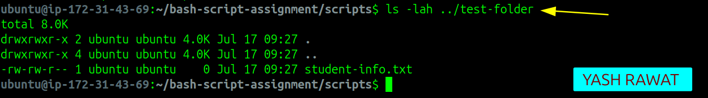

---

#### Screenshot 2 — Content of `file-check.sh`

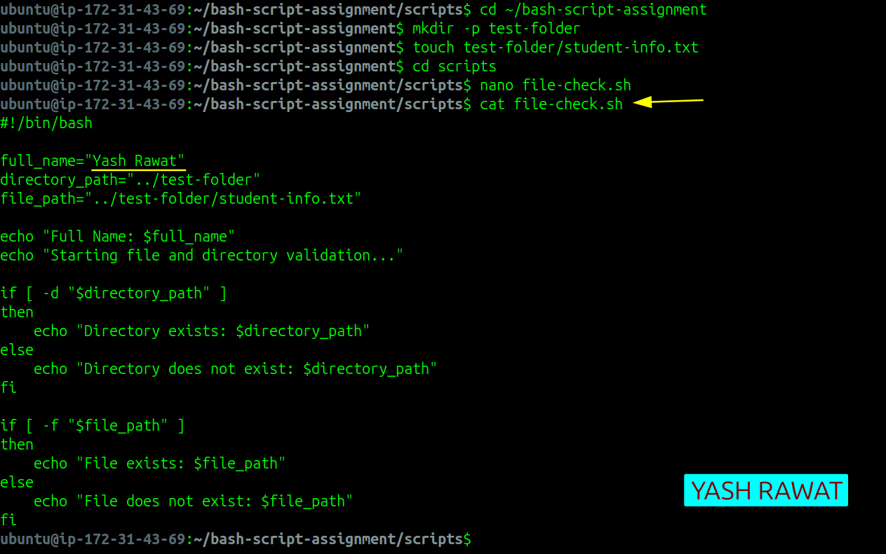

---

#### Screenshot 3 — Output of `./file-check.sh`

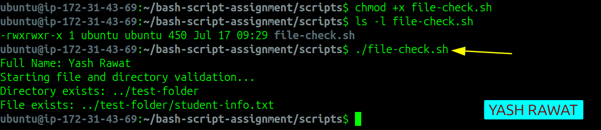

---

### Notes

Answer the following in your own words:

**1. What does `-d` check in Bash?**

The -d option checks whether a directory exists. If the directory is present, the condition returns true.

---

**2. What does `-f` check in Bash?**

The -f option checks whether a regular file exists. If the file is found, the condition returns true.

---

**3. Why should file and directory paths be stored in variables?**

Storing file and directory paths in variables makes the script easier to read and maintain. If the path changes later, we only need to update it in one place.

---

**4. What happens if the file does not exist?**

If the file does not exist, the condition becomes false, and the script runs the else block. It displays a message that the file was not found instead of stopping with an error.

---

# Task 7 — Conditionals: Pass or Retry Script

## Goal

Use if-else conditionals to make decisions based on a variable value.

### Evidence

#### Screenshot 1 — Content of `score-check.sh` with `score=85`

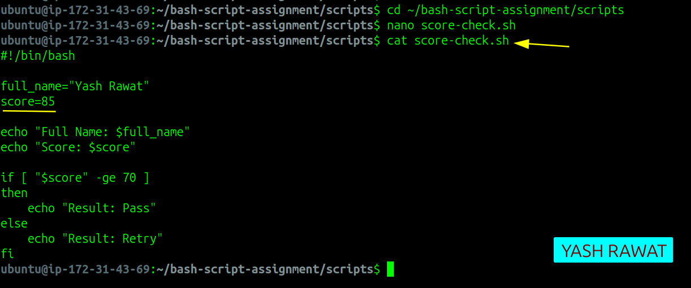

---

#### Screenshot 2 — Output showing `Result: Pass`

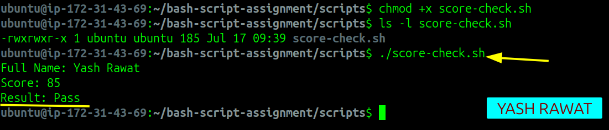

---

#### Screenshot 3 — Content of `score-check.sh` with `score=55`

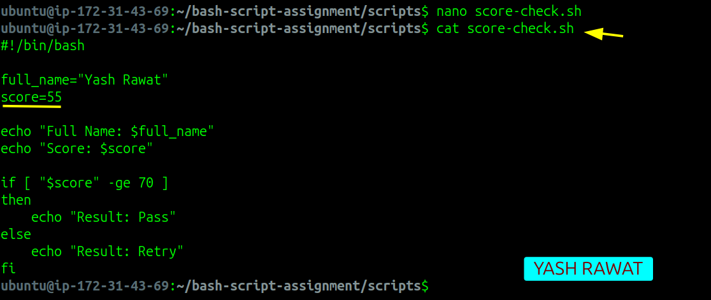

---

#### Screenshot 4 — Output showing `Result: Retry`

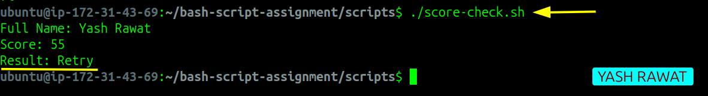

---

### Notes

Answer the following in your own words:

**1. What is the purpose of if-else in Bash?**

The if-else statement is used to make decisions in a script. It runs one set of commands if the condition is true, and another set if the condition is false.

---

**2. What does `-ge` mean?**

-ge means greater than or equal to. It is used to compare two numbers in Bash.

---

**3. Why should conditions be tested with different values?**

Testing with different values helps make sure the script works correctly in all situations. It confirms that both the if and else parts behave as expected.

---

**4. How can conditionals help in automation scripts?**

Conditionals help scripts make decisions automatically based on different situations. This reduces manual work and makes automation more reliable and efficient.

---

# Task 8 — Functions: Final Bash Automation Script

## Goal

Create a final Bash script using functions to organize reusable code.

### Evidence

#### Screenshot 1 — Content of `final-automation.sh`

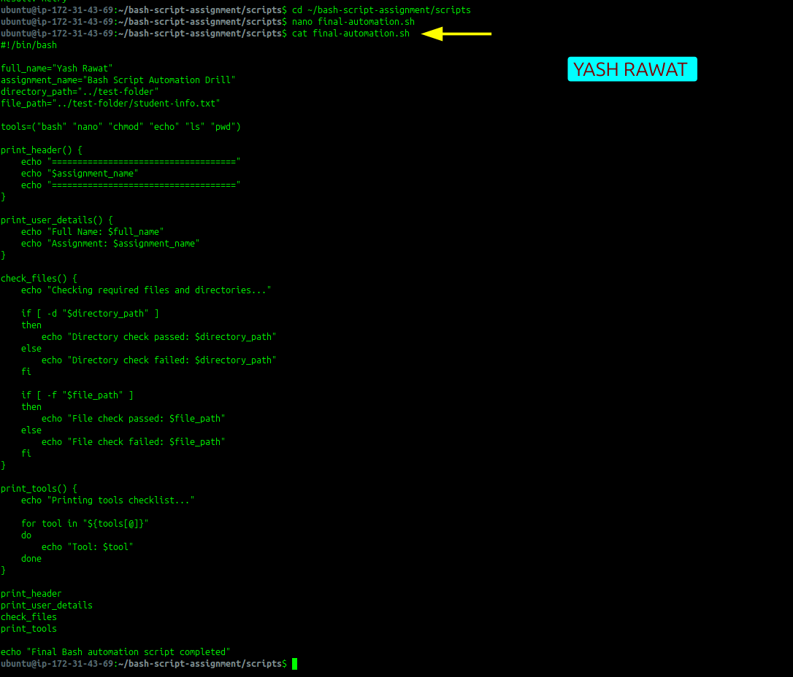

---

#### Screenshot 2 — Output of `./final-automation.sh`

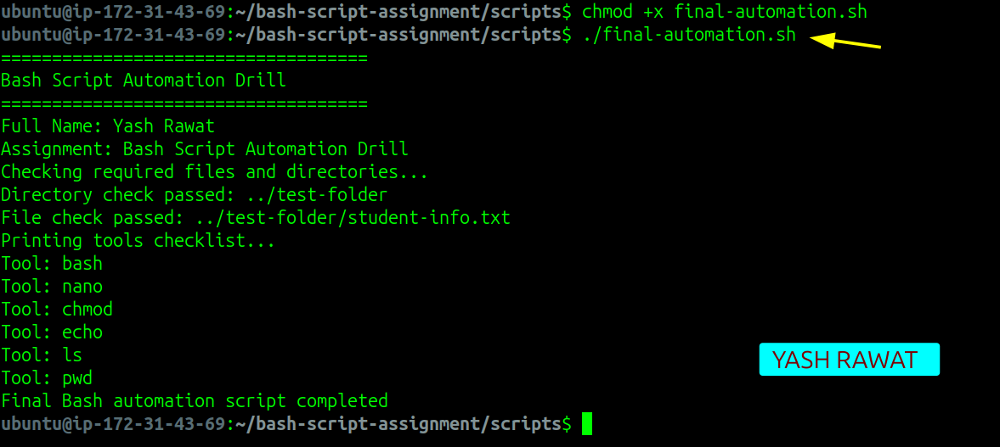

---

#### Screenshot 3 — Output of `ls -lah` showing all created scripts

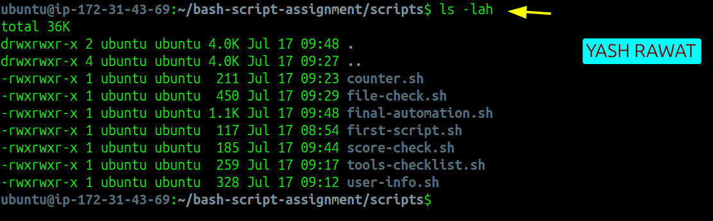

---

### Notes

Answer the following in your own words:

**1. What is a function in Bash?**

A function is a reusable block of code that performs a specific task. It helps organize the script and allows the same code to be used whenever needed.

---

**2. Why are functions useful in scripts?**

Functions make scripts cleaner and easier to manage. They reduce repeated code, improve readability, and make future updates much simpler.

---

**3. Which functions did you create in this script?**

In this script, I created four functions:

`print_header()`
`print_user_details()`
`check_files()`
`print_tools()`

Each function performs a specific task, making the script more organized.

---

**4. How does this final script combine variables, arrays, loops, conditionals, files, and functions?**

The script uses variables to store information, an array to store tool names, a loop to print each tool, conditionals to check whether the required file and directory exist, and functions to organize each task into separate sections. Together, these concepts create a simple automation script that is easy to understand and maintain.

---

# LinkedIn Post (Required)

## Evidence

#### LinkedIn Post URL

Paste your LinkedIn post URL here:

`https://www.linkedin.com/posts/yashrawat2362_dmibypravinmishra-agenticai-claudecode-ugcPost-7483828343486705664-jUtb/?utm_source=share&utm_medium=member_desktop&rcm=ACoAADkdLvUBSPhBiWFg4xDHAf9vp3Ws4aR12mQ`

---

#### Screenshot — Published LinkedIn post

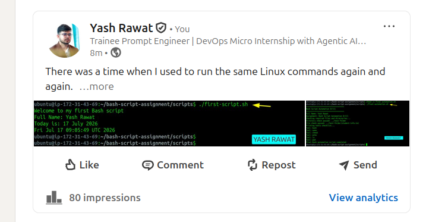

---

# Submission Instructions

- Add all required screenshots in your submission
- Full name must be visible in required screenshots
- All script files must be created and run successfully
- Required notes must be answered clearly for every task
- Do not expose sensitive information (keys, passwords, credentials)

---

# Completion Checklist

- [x] Task 1: Environment setup verified, workspace created (Screenshots 1–2, Notes answered)
- [x] Task 2: First script created, executed, permissions verified (Screenshots 1–3, Notes answered)
- [x] Task 3: Variables script created and run (Screenshots 1–2, Notes answered)
- [x] Task 4: Arrays and loops script created and run (Screenshots 1–2, Notes answered)
- [x] Task 5: Counter loop script created and run (Screenshots 1–2, Notes answered)
- [x] Task 6: File validation script created and run (Screenshots 1–3, Notes answered)
- [x] Task 7: Pass/Retry conditional script tested with both values (Screenshots 1–4, Notes answered)
- [x] Task 8: Final automation script created and run (Screenshots 1–3, Notes answered)
- [x] All scripts run without errors
- [x] Full Name visible in all required screenshots
- [x] LinkedIn post published and URL submitted
- [x] No sensitive data exposed

---

## 📌 About DMI & CloudAdvisory

DevOps Micro Internship (DMI) is a project-based DevOps program run by Pravin Mishra (The CloudAdvisory) focused on real-world execution, systems thinking, and career readiness.

It helps learners build strong DevOps foundations with hands-on experience.

---

## 📌 Resources

- 🌐 DMI Official Website: https://dmi.pravinmishra.com?utm_source=github&utm_medium=readme  
- 🎓 University: https://university.pravinmishra.com?utm_source=github&utm_medium=readme  
- 💬 Discord Community: https://discord.pravinmishra.com?utm_source=github&utm_medium=readme  
- 📝 Blog: https://dmi.pravinmishra.com/blog?utm_source=github&utm_medium=readme  
- ▶️ YouTube Playlist: https://www.youtube.com/playlist?list=PLFeSNDtI4Cho  
- 🔗 Pravin Mishra (LinkedIn): https://www.linkedin.com/in/pravin-mishra-aws-trainer/  
- 🏢 CloudAdvisory (LinkedIn): https://www.linkedin.com/company/thecloudadvisory/

---

*This submission is part of DevOps Micro Internship (DMI) Cohort 3 — Agentic AI Track.*
