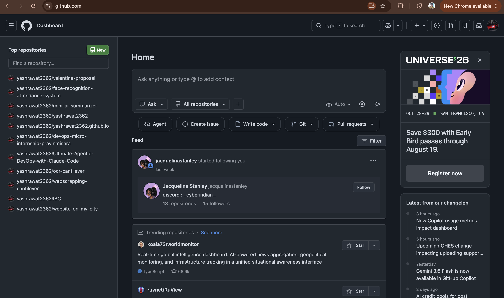
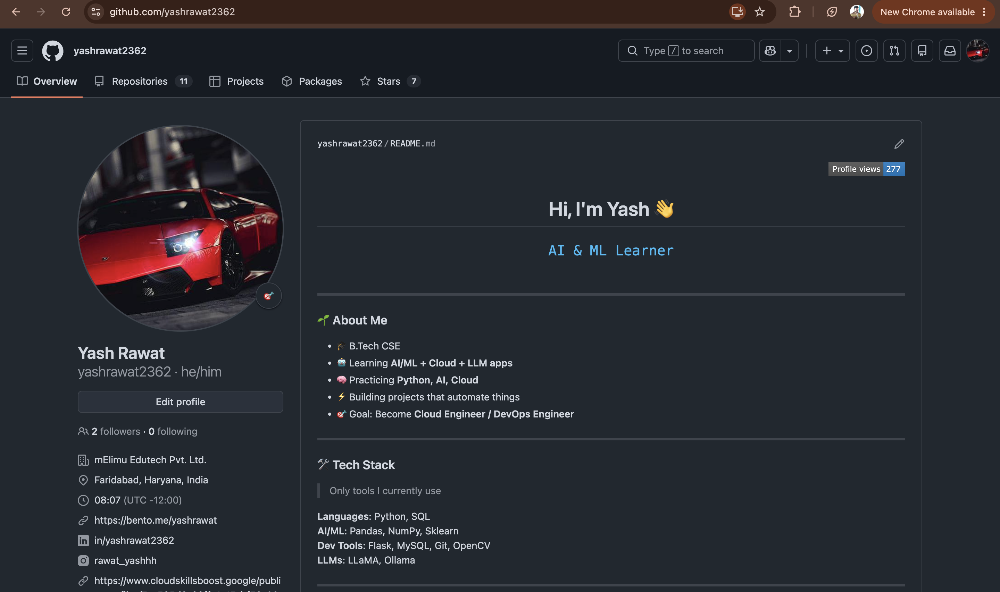
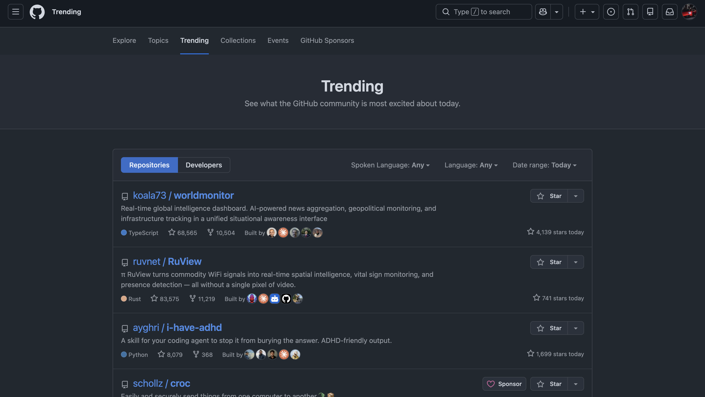
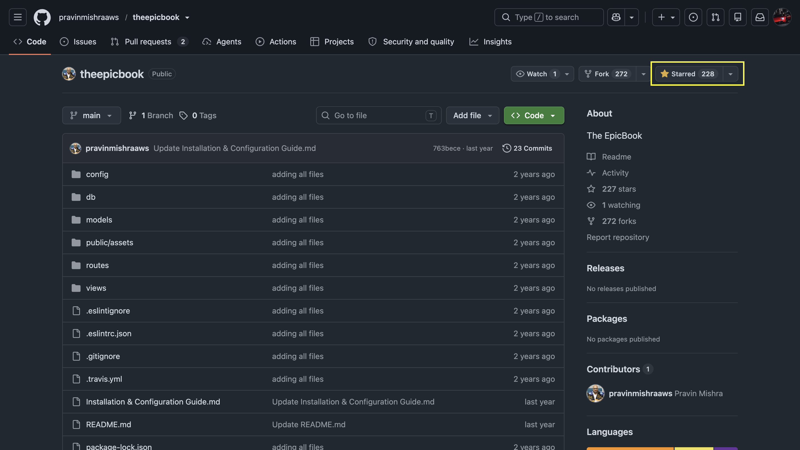
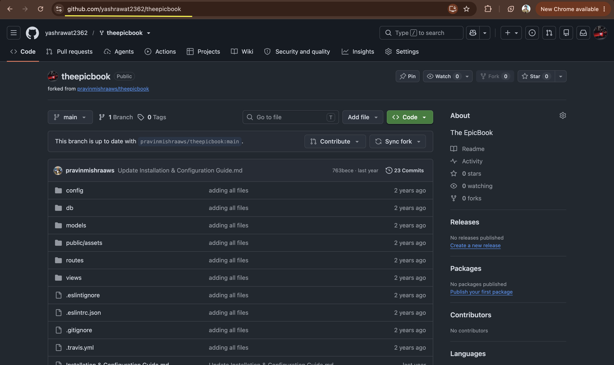
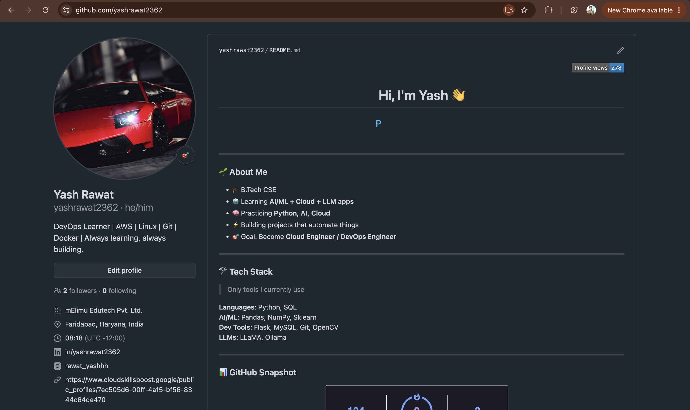

# Assignment 4 — GitHub Account, Exploration & Professional Profile Setup

Part of the DevOps Micro Internship (DMI) Cohort 3 with Agentic AI

---

## Purpose

In this assignment, you will create or confirm your GitHub account, explore repositories the way a professional would, practice starring and forking, and update your profile with professional information. This establishes a credible GitHub identity before you use GitHub for collaboration, portfolio work, and future DevOps projects.

---

# Task 1 — Create a GitHub Account (or Confirm an Existing Account)

## Goal

Confirm that you have a working GitHub account and can access your GitHub dashboard.

### Evidence

#### Screenshot 1 — GitHub dashboard or Home page showing you're signed in, with your username visible

---

#### Screenshot 2 (Optional but Recommended) — Your GitHub profile with `https://github.com/<username>` visible in the browser address bar

---

# Task 2 — Explore GitHub Like a Professional

## Goal

Browse Trending, search for a public project, star at least one repository, and fork at least one repository to your own account.

### Evidence

#### Screenshot 3 — GitHub Trending page visible in the browser

---

#### Screenshot 4 — A repository page showing the Star button in the Starred state

---

#### Screenshot 5 — Your forked repository page with your username and repository name visible in the URL

---

# Task 3 — Update Your GitHub Profile (Professional Setup)

## Goal

Add a professional bio to your GitHub profile — and optionally your location, organization, website/LinkedIn link, and a profile picture.

### Evidence

#### Screenshot 6 — Your public GitHub profile showing your username and professional bio

---

# Submission Instructions

- Add all required screenshots in your submission
- Do not expose your password, verification code, recovery codes, or authentication secrets
- Include your GitHub profile URL

---

## GitHub Profile URL

Paste your GitHub profile URL here:

`https://github.com/yashrawat2362`

---

# Completion Checklist

- [x] GitHub account created or existing account confirmed (Screenshot 1)
- [x] Trending repositories explored (Screenshot 3)
- [x] At least one repository starred (Screenshot 4)
- [x] At least one public repository forked (Screenshot 5)
- [x] Professional bio added to your GitHub profile (Screenshot 6)
- [x] GitHub profile URL included
- [x] No passwords, codes, or authentication secrets exposed

---

## 📌 About DMI & CloudAdvisory

DevOps Micro Internship (DMI) is a project-based DevOps program run by Pravin Mishra (The CloudAdvisory) focused on real-world execution, systems thinking, and career readiness.

It helps learners build strong DevOps foundations with hands-on experience.

---

## 📌 Resources

- 🌐 DMI Official Website: https://dmi.pravinmishra.com?utm_source=github&utm_medium=readme  
- 🎓 University: https://university.pravinmishra.com?utm_source=github&utm_medium=readme  
- 💬 Discord Community: https://discord.pravinmishra.com?utm_source=github&utm_medium=readme  
- 📝 Blog: https://dmi.pravinmishra.com/blog?utm_source=github&utm_medium=readme  
- ▶️ YouTube Playlist: https://www.youtube.com/playlist?list=PLFeSNDtI4Cho  
- 🔗 Pravin Mishra (LinkedIn): https://www.linkedin.com/in/pravin-mishra-aws-trainer/  
- 🏢 CloudAdvisory (LinkedIn): https://www.linkedin.com/company/thecloudadvisory/

---

*This submission is part of DevOps Micro Internship (DMI) Cohort 3 — Agentic AI Track.*
