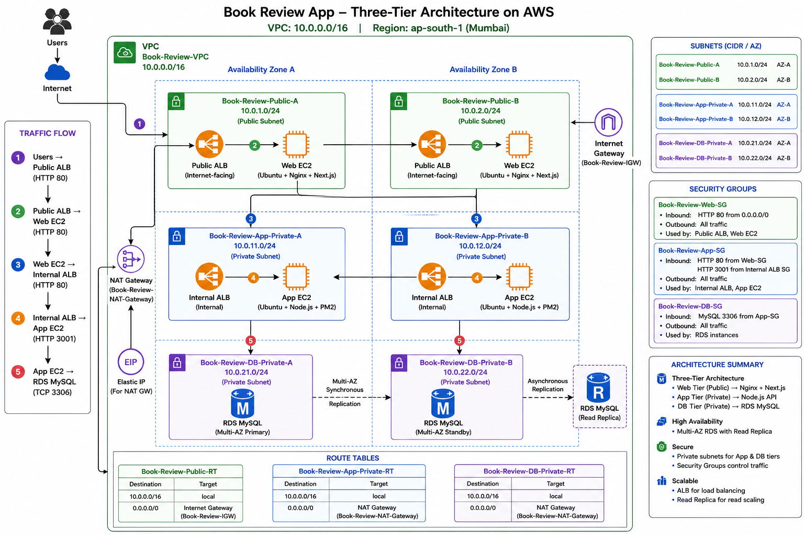
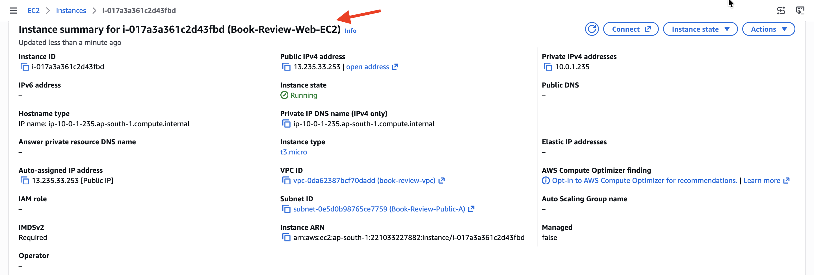
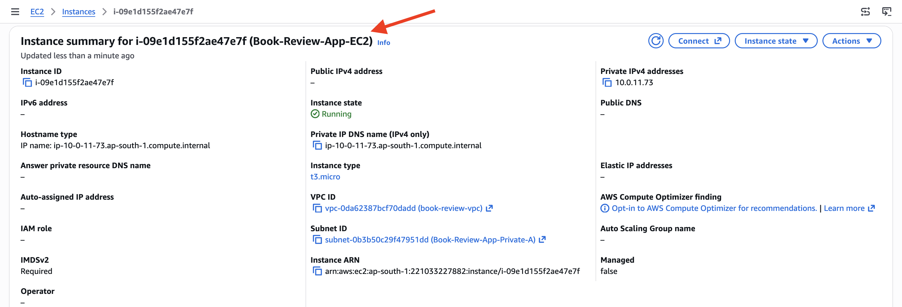
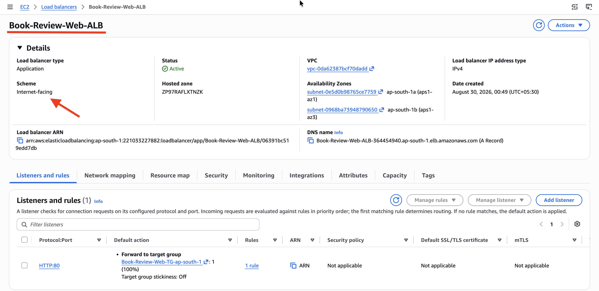
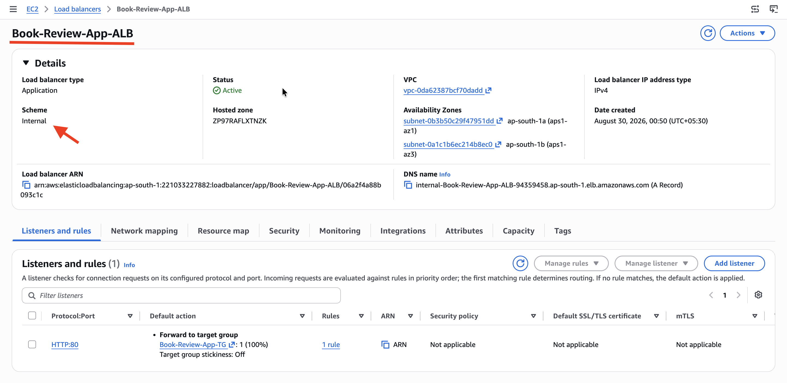
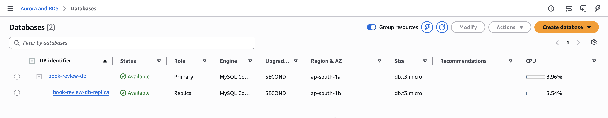
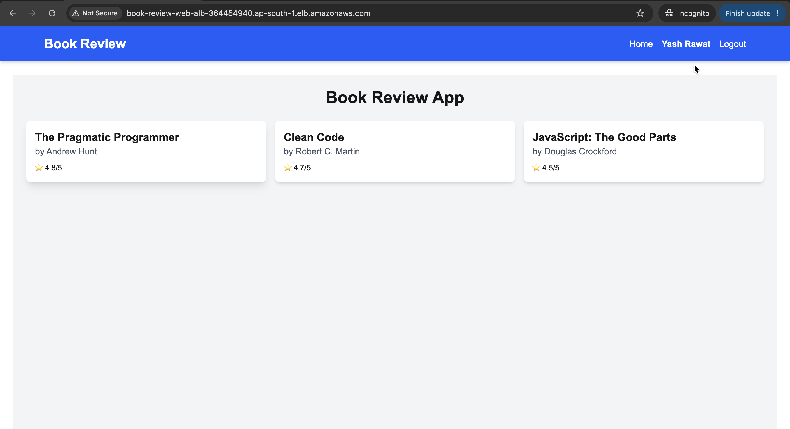
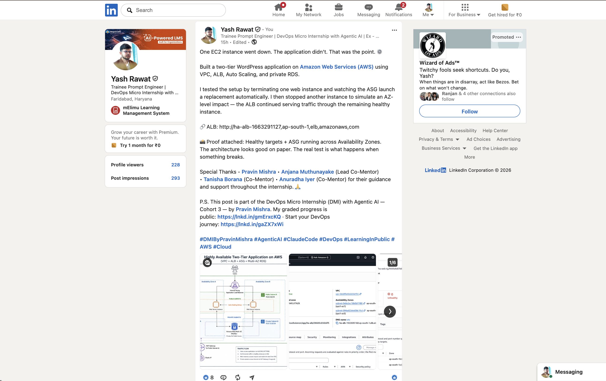

# Assignment 6 — Capstone Assignment — Deploy Book Review App (Three-Tier Architecture) on AWS

Part of the DevOps Micro Internship (DMI) Cohort 3 with Agentic AI

---

## Purpose

This is the most important assignment of the course. You will deploy the Book Review App in a fully production-style three-tier architecture on AWS: a Next.js Web Tier behind Nginx and a public ALB, a private Node.js/Express App Tier behind an internal ALB, and a private Multi-AZ MySQL RDS database with a read replica. You are expected to design, deploy, isolate, debug, and document the result independently.

---

# Task 1 — Architecture Diagram

## Goal

Create an architecture diagram showing the custom VPC (10.0.0.0/16), the six subnets across two Availability Zones (two public Web Tier, two private App Tier, two private Database Tier), the public ALB, Web Tier EC2/Nginx, internal ALB, private App Tier EC2, private Multi-AZ RDS with its read replica, and the permitted traffic flow.

### Evidence

#### Diagram image or link



---

# Task 2 — AWS Region & Services Used

## Goal

Record the AWS Region used and list every AWS service used across networking, compute, load balancing, security, and the database.

### Notes

**Region:**

Asia Pacific (Mumbai) — `ap-south-1`

---

**Services:**

* Amazon VPC — Custom VPC and subnet networking
* Amazon EC2 — Web Tier and App Tier servers
* Elastic Load Balancing (Application Load Balancer) — Public ALB and Internal ALB
* Amazon RDS for MySQL — Private database, Multi-AZ deployment, and Read Replica
* Internet Gateway (IGW) — Internet connectivity for public subnets
* NAT Gateway — Outbound internet access for private subnets
* Amazon Route Tables — Public and private subnet routing
* Amazon Security Groups — Network access control between the three tiers

---

# Task 3 — Public Entry Point

## Goal

Confirm the Book Review App loads through the public ALB DNS name.

### Evidence

#### Public ALB DNS

Paste your public ALB DNS name here:

`http://book-review-web-alb-364454940.ap-south-1.elb.amazonaws.com`

---

# Task 4 — Evidence Screenshots

## Goal

Capture visual proof of every tier and load balancer.

### Evidence

#### Web EC2



---

#### App EC2



---

#### Public ALB



---

#### Internal ALB



---

#### RDS + Replica



---

#### App UI proof



---

# Task 5 — Summary

## Goal

Summarize what worked in the final deployment, the issues encountered and how each was fixed, and the tools or sources used to research and debug.

### Notes

**What worked:**

Successfully deployed the Book Review App using a three-tier AWS architecture in the ap-south-1 region. The Web Tier was deployed on a public subnet using Ubuntu, Nginx, and Next.js behind a public Application Load Balancer. The App Tier was deployed in private subnets using Node.js/Express behind an internal Application Load Balancer, while Amazon RDS for MySQL was deployed in private database subnets with Multi-AZ and a read replica. Security Groups were configured to control traffic between the Web, App, and Database tiers.

---

**Issues + fixes:**

### 1. Registration failing — frontend hitting the wrong URL
The frontend's `api.js` builds requests as `${NEXT_PUBLIC_API_URL}/users/register`, but no `.env.local` file existed on the server, so it fell back to the hardcoded default `http://localhost:3001` instead of the deployed backend.
 
**Fix:** Created `.env.local` with `NEXT_PUBLIC_API_URL=/api`, then rebuilt (`npm run build`), since Next.js bakes `NEXT_PUBLIC_*` variables in at **build time**, not runtime.
 
### 2. 500 Internal Server Error on registration
Once the URL was correct, the backend started rejecting requests. PM2 logs revealed a `CORS policy: Not allowed by server` error being thrown before the request ever reached the registration logic.
 
### 3. CORS misconfiguration — wrong value in `ALLOWED_ORIGINS`
The backend's `ALLOWED_ORIGINS` environment variable contained a leftover placeholder (`https://IP:port`), and later, mistakenly, the **RDS database hostname** — neither of which is a valid browser origin.
 
**Fix:** Traced the actual request chain (frontend Nginx → internal ALB → backend) and set `ALLOWED_ORIGINS` to the correct public-facing origin the browser actually sends.
 
### 4. CORS still failing after the "fix" — case sensitivity
Even after correcting the value, CORS errors persisted. Added a temporary debug `console.log` inside the CORS `origin` callback to print the incoming `Origin` header and compare it character-by-character against the allow-list.
 
Found the allow-list had the ALB hostname capitalized (`Book-Review-Web-ALB...`), while the actual browser-sent origin was lowercase (`book-review-web-alb...`). `Array.includes()` performs an exact, case-sensitive match.
 
**Fix:** Made the `.env` value lowercase to match the browser's origin exactly.
 
### 5. 404 "Cannot POST /users/register" after CORS was resolved
With CORS passing, the request now reached the server but returned `Cannot POST /users/register` — missing its `/api` prefix. Traced this to the frontend's **Nginx reverse proxy** config (`sites-available/book-review`):
 
```nginx
location /api/ {
    proxy_pass http://internal-ALB.../;   # trailing slash strips the /api prefix
}
```
 
In Nginx, when a `proxy_pass` target includes a path (even just `/`), it replaces the matched `location` prefix before forwarding upstream — silently stripping `/api` from every request.
 
**Fix:** Removed the trailing slash from `proxy_pass` so the full original URI (`/api/users/register`) passed through untouched to the backend.
 
### 6. `/api/api/books` 404 on the books page
A separate, unrelated bug: one page (`src/app/page.js`) hardcoded an extra `/api` segment on top of `NEXT_PUBLIC_API_URL` (which already resolved to `/api`), duplicating the prefix — unlike the correctly-written `fetchBooks()` helper already present in `api.js`.
 
**Fix:** Removed the redundant `/api` segment from that one call so it matched the pattern used elsewhere in the codebase.

---

**Tools/sources used:**

- **Browser DevTools (Network tab)** — inspected request URL, status code, response body, and the `Origin` request header to pinpoint each failure at the HTTP level.
- **`pm2 logs`** — live-tailed and flushed (`pm2 flush`) for clean, single-request traces of backend stack traces and custom debug logging.
- **Targeted shell inspection** (`grep`, `cat`, `sed`) — checked `.env`, `.env.local`, `server.js`, `api.js`, and the Nginx config directly instead of assuming configuration matched intent.
- **Temporary inline debug logging** — added a `console.log` inside the CORS `origin` callback to surface the exact string being compared, which revealed the case-sensitivity mismatch.
- **`nginx -t`** — validated config syntax before every reload, to avoid breaking the site mid-debug.

---

# LinkedIn Post (Required)

## Goal

Publish a LinkedIn post sharing the capstone deployment, including the public ALB DNS (or a redacted screenshot), three to five lines on what you built and why it is production-style, and one proof screenshot.

## Evidence

#### LinkedIn Post URL

Paste your LinkedIn post URL here:

`https://lnkd.in/p/d2t48CQY`

---

#### Screenshot of LinkedIn post



---

# Submission Instructions

- Add all required screenshots and links in your submission
- Do not expose passwords, RDS credentials, connection strings, private keys, or account IDs

---

# Completion Checklist

- [x] Task 1: Architecture diagram completed
- [x] Task 2: AWS Region and services documented
- [x] Task 3: Public ALB DNS confirmed working
- [x] Task 4: All six evidence screenshots captured (Web Tier, App Tier, both ALBs, RDS + replica, app UI)
- [x] Task 5: Deployment summary completed (what worked, issues/fixes, tools/sources)
- [x] LinkedIn post published and URL submitted
- [x] App Tier and Database Tier confirmed not publicly accessible
- [x] No sensitive data exposed

---

## 📌 About DMI & CloudAdvisory

DevOps Micro Internship (DMI) is a project-based DevOps program run by Pravin Mishra (The CloudAdvisory) focused on real-world execution, systems thinking, and career readiness.

It helps learners build strong DevOps foundations with hands-on experience.

---

## 📌 Resources

- 🌐 DMI Official Website: https://dmi.pravinmishra.com?utm_source=github&utm_medium=readme  
- 🎓 University: https://university.pravinmishra.com?utm_source=github&utm_medium=readme  
- 💬 Discord Community: https://discord.pravinmishra.com?utm_source=github&utm_medium=readme  
- 📝 Blog: https://dmi.pravinmishra.com/blog?utm_source=github&utm_medium=readme  
- ▶️ YouTube Playlist: https://www.youtube.com/playlist?list=PLFeSNDtI4Cho  
- 🔗 Pravin Mishra (LinkedIn): https://www.linkedin.com/in/pravin-mishra-aws-trainer/  
- 🏢 CloudAdvisory (LinkedIn): https://www.linkedin.com/company/thecloudadvisory/

---

*This submission is part of DevOps Micro Internship (DMI) Cohort 3 — Agentic AI Track.*
