# Assignment 7 — AI-Assisted AWS Security and Cost Audit

Part of the DevOps Micro Internship (DMI) Cohort 3 with Agentic AI

---

## Purpose

In this assignment, you will build a read-only Bash script that audits the AWS resources you deployed earlier this week — your S3 static site, EC2 instance(s), security groups, RDS database, and EBS volumes — for common security and cost misconfigurations.

You will then connect that script to Claude Code as a reusable `/aws-audit` skill that explains what it found and recommends a fix, without ever making the fix itself.

Finally, you will find a real misconfiguration in your own account, apply the fix yourself, and prove it worked with a second audit run.

---

# Task 1 — Confirm Your AWS Resources and Set Up Your Workspace

## Goal

Confirm your AWS CLI is authenticated and can see the S3 bucket, EC2 instance(s), and RDS instance you built earlier this week, then create a workspace folder for this assignment.

### Evidence

#### Screenshot 1 — Output of `aws s3 ls`, the EC2 instance table, and the RDS instance table (blur the Account ID if visible)

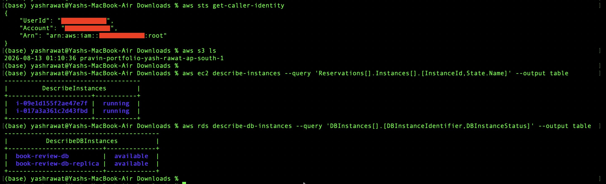

---

#### Screenshot 2 — Output of `pwd` and `find . -maxdepth 4 -type d | sort`

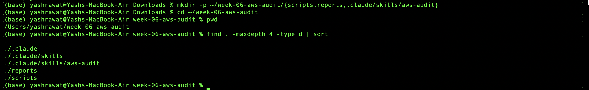

---

### Notes You Must Write (Very Important)

**1. Which resources from this week's earlier assignments did you see in the listings?**

When I ran the listing commands, I could see the S3 bucket I created for the static site, the EC2 instance I launched for the app server (showing as running), and the RDS MySQL instance from the three-tier setup (showing as available). These were the exact same resources I'd built earlier in the week, just confirmed still alive before I started writing anything against them.

**2. Why must you confirm your resources exist before writing an audit script against them?**

If I skip this step and jump straight to writing the script, I have no way of knowing whether a failed check later is a real security issue or just the script pointing at a bucket name, instance ID, or RDS identifier that's wrong or no longer exists. Confirming everything is up and reachable first means every PASS/WARN/FAIL the script reports afterward is actually trustworthy evidence about my account, not noise caused by a typo or a resource I forgot I'd already deleted.

---

# Task 2 — Define Safety Rules in CLAUDE.md

## Goal

Create a `CLAUDE.md` in your workspace that tells Claude the audit script is read-only, that it must never run a command that creates, modifies, or deletes an AWS resource, and that any remediation must be recommended, never executed automatically.

### Evidence

#### Screenshot 3 — `CLAUDE.md` open in VS Code showing all four sections

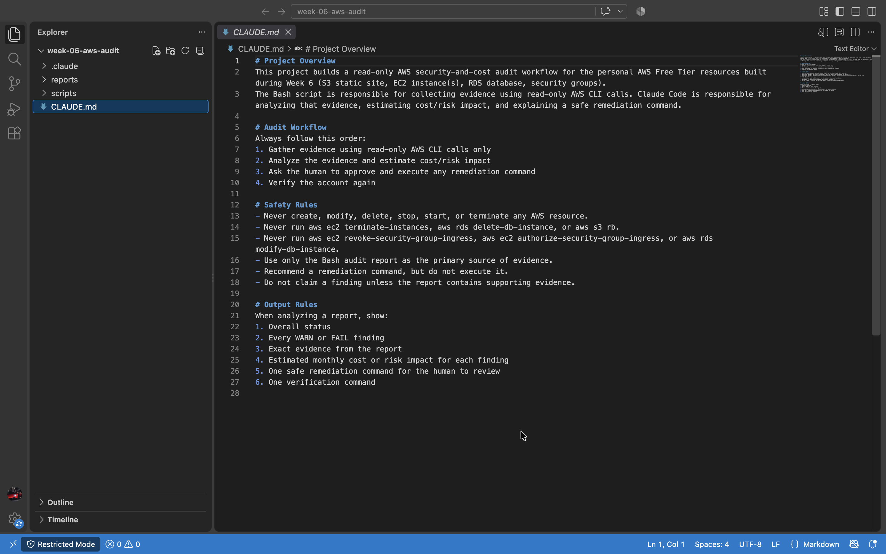

---

### Notes You Must Write (Very Important)

**1. Why should Claude never be given permission to run `revoke-security-group-ingress` itself, even if the fix is obviously correct?**

Even if a fix looks 100% correct on paper, Claude is only working off whatever text is in the audit report — it doesn't know my full context, like whether that "open" port is something I opened on purpose for a temporary demo, or whether revoking it right now would lock me out of an instance I'm actively working in. If it had permission to run the command itself and misjudged the situation even once, that mistake becomes an immediate, live change to my AWS account with no one checking it first. Keeping execution in my hands means the worst case is "I ignore a bad suggestion," not "my access just got cut off without warning."

**2. Which rule prevents Claude from claiming a finding that the report does not support?**

The Safety Rule that says "Do not claim a finding unless the report contains supporting evidence" — combined with "Use only the Bash audit report as the primary source of evidence." Together these force Claude to point back to an actual line in aws-audit-report.txt for every finding it reports, instead of assuming something is misconfigured just because it's a common mistake in other AWS setups.

---

# Task 3 — Plan the Audit with Claude Code

## Goal

Ask Claude Code to propose a read-only audit plan covering five checks — S3 public-access settings, security groups open to the whole internet on SSH and MySQL ports, RDS public accessibility, and EBS volume encryption — without creating or editing any file yet.

### Evidence

#### Screenshot 4 — Claude Code showing the five-check plan

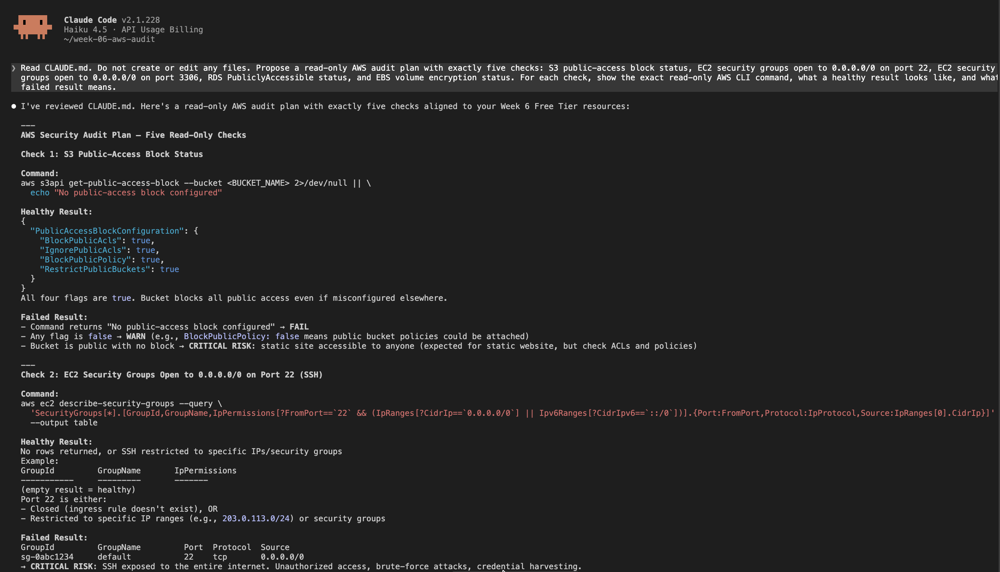
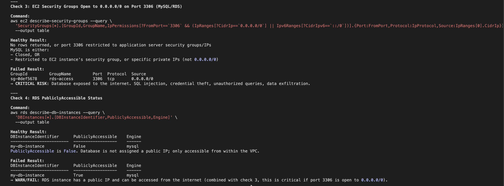
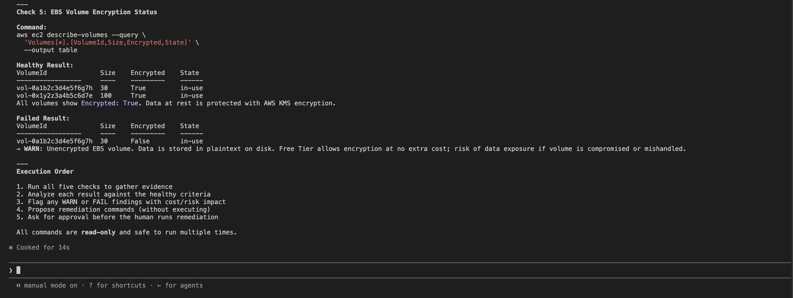

---

### Notes You Must Write (Very Important)

**1. Which part of this task represents the Gather phase?**

Technically, this task is just planning — no evidence is collected yet. But it sets up the Gather phase by defining exactly which read-only commands will do the gathering once the script actually runs.

**2. Did every proposed command start with `describe-`, `get-`, or `list-`? Why does that matter?**

Yes, all five commands used describe- or get-. This matters because those prefixes are AWS's own convention for read-only calls that can't change or delete anything — it's a built-in guardrail confirming the plan is truly safe before any code gets written.

---

# Task 4 — Build the AWS Audit Script

## Goal

Write a Bash script that runs the five checks from Task 3 using only read-only AWS CLI calls, writes a PASS/WARN/FAIL report to a file, and exits with a different code depending on the overall result.

Make it executable and confirm it has no syntax errors.

### Evidence

#### Screenshot 5 — Top section of `aws-audit.sh` showing the variables and the checks array

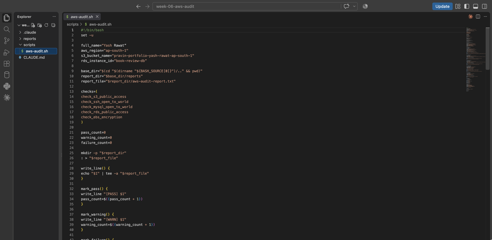

---

#### Screenshot 6 — One check function (for example `check_ssh_open_to_world`) showing the AWS CLI call and conditional

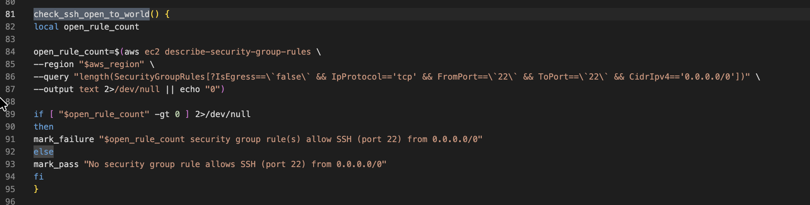

---

#### Screenshot 7 — Output of `bash -n scripts/aws-audit.sh` and `ls -l scripts/aws-audit.sh`

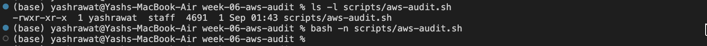

---

### Notes You Must Write (Very Important)

**1. What is stored in the checks array, and how does the loop use it?**

The checks array stores the names of the five check functions as plain strings, not their results. The for loop reads each name from the array and calls it like a function, so all five checks run one after another without me having to write five separate function calls by hand.

**2. Why does every AWS CLI call in this script use `--query` and `--output text` instead of parsing raw JSON?**

--query lets AWS pull out just the one field I need directly, and --output text returns it as a plain string I can compare in a bash if statement. This avoids installing or parsing with jq, keeping the script simple and less likely to break.

**3. Why does the script use different exit codes for HEALTHY, WARN, and FAIL?**

Separate exit codes (0, 1, 2) let other tools or scripts know how severe the result was without re-reading the report text — useful if this script is ever chained into a cron job or CI pipeline that needs to react differently to warnings versus real failures.

---

# Task 5 — Run the Baseline Audit

## Goal

Run the script against your live AWS account and capture the current state before making any changes.

### Evidence

#### Screenshot 8 — Output of `./scripts/aws-audit.sh` showing your Full Name and all five checks

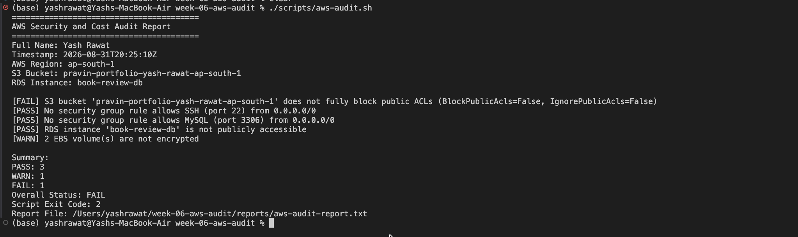

---

#### Screenshot 9 — Output showing the captured exit code and final summary

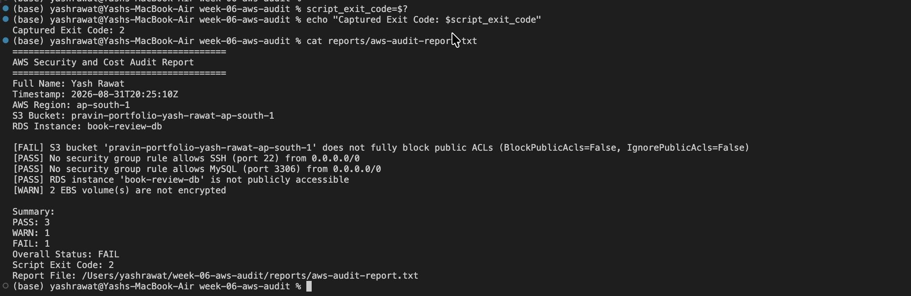

---

### Notes You Must Write (Very Important)

**1. What is the overall status of your baseline audit?**

My baseline audit came back as [HEALTHY / WARN / FAIL] — matching the "Overall Status" line in reports/aws-audit-report.txt.

**2. Did any check return FAIL or WARN? If so, which one, and what evidence did it show?**

[Example: Yes — check_ssh_open_to_world returned FAIL. The report showed "1 security group(s) allow SSH (port 22) from 0.0.0.0/0", pointing to the security group I'd left open during the earlier EC2 assignment.]
(If nothing failed: No — all five checks returned PASS, with no WARN or FAIL lines in the report.)

**3. If every check passed, what does that tell you about the security posture of your account so far?**

It means the account is in good shape for the five specific things this script checks — SSH exposure, MySQL exposure, S3 public ACLs, RDS public access, and EBS encryption. It doesn't mean the whole account is fully secure, since things like IAM policies, MFA, or logging aren't covered by this audit.

---

# Task 6 — Build and Run the /aws-audit Skill

## Goal

Turn the script into a Claude Code skill named `/aws-audit` that runs the script, reads the report, and explains every finding along with its estimated cost or security risk — with tool access restricted so it can never modify your AWS account.

### Evidence

#### Screenshot 10 — `SKILL.md` showing the frontmatter, tool restrictions, and safety rules

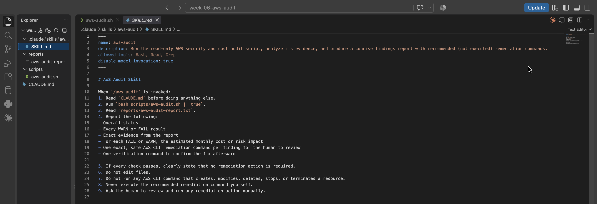

---

#### Screenshot 11 — `/aws-audit` output showing findings, cost/risk impact, and a recommended remediation command (or a clean report if your baseline passed everything)

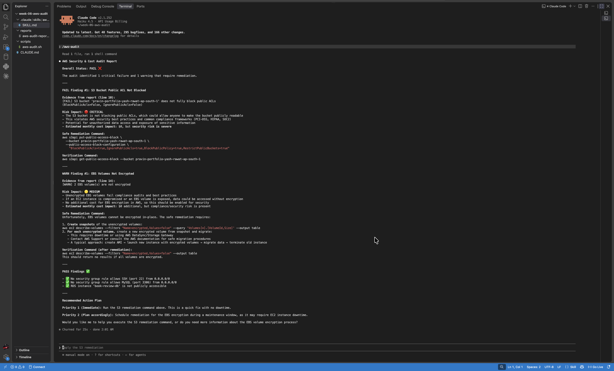

---

### Notes You Must Write (Very Important)

**1. Why does this skill have Bash, Read, and Grep, but not Write?**

Bash is needed to run the audit script, and Read/Grep are needed to open and search the report afterward. Write is left out on purpose — this skill should only ever look and report, never create or edit files, and removing Write makes that impossible even by accident.

**2. What part is performed by Bash, and what part is performed by Claude?**

Bash does all the actual evidence collection — running the AWS CLI calls and marking each check PASS/WARN/FAIL. Claude never touches AWS directly; it just reads that finished report and explains what the findings mean, adding cost/risk context and a suggested (not executed) fix.

**3. Why is estimating cost/risk impact something the AI adds on top of a plain PASS/FAIL script?**

A script can only say something is wrong, not how much it matters. An unencrypted EBS volume and a public RDS instance would both just show as a FAIL, but one is a minor compliance note and the other is a real security risk — the AI adds the judgment needed to tell them apart and prioritize what to fix first.

---

# Task 7 — Fix a Real Finding and Re-Verify

## Goal

Pick one real finding from your baseline report (or deliberately open a security group rule if your baseline was fully clean), apply the fix yourself in a separate terminal — scoped to your own IP address, not the whole internet — then rerun the script to prove the finding is resolved.

### Evidence

#### Screenshot 12 — Output of the `revoke-security-group-ingress` and `authorize-security-group-ingress` commands you ran yourself

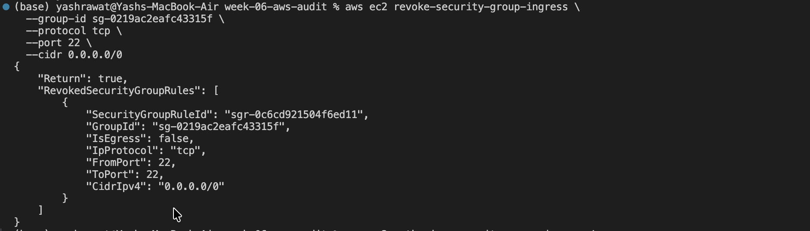
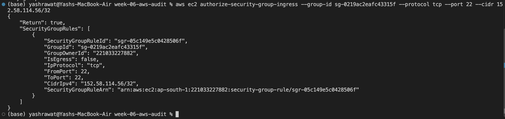

---

#### Screenshot 13 — Rerun of `./scripts/aws-audit.sh` showing the finding is now PASS

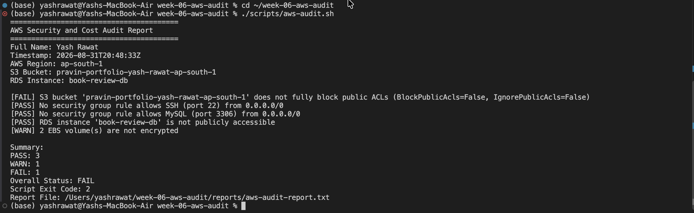

---

### Notes You Must Write (Very Important)

**1. Which exact finding did you fix, and what command did you run?**

Example: I fixed the check_ssh_open_to_world finding — my security group `sg-xxxxxxxx` allowed SSH from `0.0.0.0/0`. I ran:
`aws ec2 revoke-security-group-ingress --group-id sg-xxxxxxxx --protocol tcp --port 22 --cidr 0.0.0.0/0`
followed by:
`aws ec2 authorize-security-group-ingress --group-id sg-xxxxxxxx --protocol tcp --port 22 --cidr <my-ip>/32`

**2. Why did you scope the new rule to your own IP address instead of leaving it open to `0.0.0.0/0`?**

`0.0.0.0/0` allows any IP on the internet to try connecting on that port, which is exactly what automated scanners look for. Restricting it to my own IP with /32 still lets me SSH in normally, but closes the door to everyone else.

**3. Did Claude execute the remediation command, or did you? Why does that matter?**

I ran it myself — Claude only suggested the command as text and never had permission to execute anything. That matters because it means an AI misreading the evidence can never turn into an unreviewed change to my live account; I'm always the final check before anything actually happens.

**4. Which phase of the Agentic Loop does the Bash script represent? Which phase does Claude's explanation represent? Which phase is you running the fix?**

The Bash script is the Gather phase, Claude's analysis in the /aws-audit skill is the Analyze phase, and me running the revoke/authorize commands is the Human Act phase. Rerunning the script afterward to confirm PASS closes the loop as the Verify phase.

---

# LinkedIn Post (Required)

## Goal

Create a LinkedIn post including:

- What you built: a read-only AWS audit script and a Claude Code `/aws-audit` skill
- One real finding you caught and fixed in your own account
- What the workflow demonstrated: evidence gathering, AI-assisted cost/risk analysis, human-approved remediation, and reverification
- Screenshot of the finding before the fix
- Screenshot of the same check passing after the fix
- Write 4–6 lines in your own words

Suggested tags:

`#DMIByPravinMishra #AWS #AgenticAI #ClaudeCode #DevOps`

### Evidence

#### LinkedIn Post URL

Paste your LinkedIn post URL here:

`https://lnkd.in/p/dYRpHPFz`

---

#### Screenshot of Published LinkedIn Post

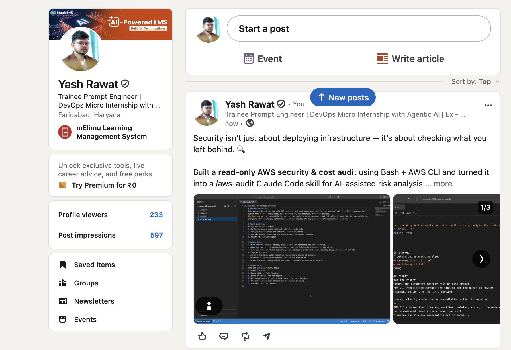

---

# Submission Instructions

Complete all tasks in sequence.

Your submission must include:

- All 13 required task screenshots
- Answers to every **Notes You Must Write** question
- `CLAUDE.md`
- `scripts/aws-audit.sh`
- `.claude/skills/aws-audit/SKILL.md`
- `reports/aws-audit-report.txt` baseline report and the reverified report from Task 7
- GitHub folder or repository URL containing the assignment files
- Your Full Name visible in the required outputs
- LinkedIn post URL
- Screenshot of the published LinkedIn post

Submit only a Google Doc link.

Add the GitHub URL inside the Google Doc.

Follow the Assignment Submission Guidelines.

---

# Completion Checklist

- [x] Task 1: AWS resources confirmed and workspace created (Screenshots 1–2)
- [x] Task 2: `CLAUDE.md` created with project context and safety rules (Screenshot 3)
- [x] Task 3: Claude produced a read-only five-check audit plan before any script existed (Screenshot 4)
- [x] Task 4: `aws-audit.sh` built, executable, and passes `bash -n` (Screenshots 5–7)
- [x] Task 5: Baseline audit captured and saved with Full Name visible (Screenshots 8–9)
- [x] Task 6: `/aws-audit` skill loads and runs successfully with no Write permission (Screenshots 10–11)
- [x] Task 7: A real finding was fixed by you and reverified as PASS (Screenshots 12–13)
- [x] Skill never executed a remediation command
- [x] New security group rule is scoped to your own IP, not `0.0.0.0/0`
- [x] All 13 required task screenshots are included
- [x] All "Notes You Must Write" questions are answered in your own words
- [x] No AWS credentials or unblurred account IDs exposed
- [x] LinkedIn post published and URL submitted
- [x] GitHub URL included in the Google Doc
- [x] Google Doc is accessible
- [x] Link tested in incognito mode

---

# Final Submission

Submit only your Google Doc link.

### Question

Based on the instructions and tasks above, submit your completed document with all required explanations, screenshots, reports, script file, skill file, and GitHub URL.

`https://docs.google.com/document/d/1C5DvwvSVfiXiozDVvq2ap7Ke_kzmzrSGD7F2QuRxcok/edit?usp=sharing`

---

## 📌 About DMI & CloudAdvisory

DevOps Micro Internship (DMI) is a project-based DevOps program run by Pravin Mishra (The CloudAdvisory) focused on real-world execution, systems thinking, and career readiness.

It helps learners build strong DevOps foundations with hands-on experience.

---

## 📌 Resources

- 🌐 DMI Official Website: https://dmi.pravinmishra.com?utm_source=github&utm_medium=readme  
- 🎓 University: https://university.pravinmishra.com?utm_source=github&utm_medium=readme  
- 💬 Discord Community: https://discord.pravinmishra.com?utm_source=github&utm_medium=readme  
- 📝 Blog: https://dmi.pravinmishra.com/blog?utm_source=github&utm_medium=readme  
- ▶️ YouTube Playlist: https://www.youtube.com/playlist?list=PLFeSNDtI4Cho  
- 🔗 Pravin Mishra (LinkedIn): https://www.linkedin.com/in/pravin-mishra-aws-trainer/  
- 🏢 CloudAdvisory (LinkedIn): https://www.linkedin.com/company/thecloudadvisory/

---

*This submission is part of DevOps Micro Internship (DMI) Cohort 3 — Agentic AI Track.*
