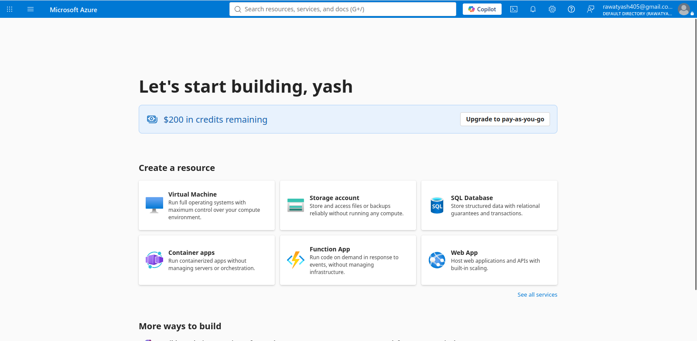

# Assignment 1 — Create and Set Up Your Azure Free Account

Part of the DevOps Micro Internship (DMI) Cohort 3 with Agentic AI

---

## Purpose

In this assignment, you will set up a fully functional Microsoft Azure Free Account so you are ready to start cloud-based assignments and hands-on labs. You will complete identity and payment verification, accept the required terms, sign in to the Azure Portal, and confirm the Free Trial subscription is available.

---

# Task 1 — Create Your Azure Free Account

## Goal

Sign up at the official Azure Free Account page, complete identity and phone verification, provide payment verification, and accept the Microsoft Agreement and Offer Terms.

> No screenshot required for this task. Do not capture payment-card details. Completion is verified through Task 2.

---

# Task 2 — Access and Explore the Azure Portal

## Goal

Sign in to the Azure Portal, locate key services (Resource Groups, Virtual Machines, Storage, App Services), and confirm the Free Trial subscription is shown under Subscriptions.

### Evidence

#### Screenshot 1 — Azure Portal homepage after successful login

---

#### Screenshot 2 — "Subscriptions" section showing the "Free Trial" subscription

---

### Notes

Write a three-to-four-line paragraph explaining which Azure services you plan to explore first and why.

- I plan to explore **Azure Virtual Machines, Resource Groups, Storage Accounts, and App Services** first.
- I want to understand how Azure organizes and manages cloud resources through Resource Groups.
- Virtual Machines will help me practice deploying and managing servers, while Storage and App Services will introduce me to cloud storage and application deployment.
- These services will give me a strong foundation for applying my DevOps skills in Azure.

---

# Submission Instructions

- Add all required screenshots in your submission
- Do not expose payment-card details, phone numbers, or other sensitive account information

---

# Completion Checklist

- [x] Azure Free Account created with identity, phone, and payment verification completed
- [x] Microsoft Agreement and Offer Terms accepted
- [x] Azure Portal accessed successfully (Screenshot 1)
- [x] Free Trial subscription confirmed (Screenshot 2)
- [x] Reflection paragraph written (Notes)
- [x] No sensitive information exposed

---

## 📌 About DMI & CloudAdvisory

DevOps Micro Internship (DMI) is a project-based DevOps program run by Pravin Mishra (The CloudAdvisory) focused on real-world execution, systems thinking, and career readiness.

It helps learners build strong DevOps foundations with hands-on experience.

---

## 📌 Resources

- 🌐 DMI Official Website: https://dmi.pravinmishra.com?utm_source=github&utm_medium=readme  
- 🎓 University: https://university.pravinmishra.com?utm_source=github&utm_medium=readme  
- 💬 Discord Community: https://discord.pravinmishra.com?utm_source=github&utm_medium=readme  
- 📝 Blog: https://dmi.pravinmishra.com/blog?utm_source=github&utm_medium=readme  
- ▶️ YouTube Playlist: https://www.youtube.com/playlist?list=PLFeSNDtI4Cho  
- 🔗 Pravin Mishra (LinkedIn): https://www.linkedin.com/in/pravin-mishra-aws-trainer/  
- 🏢 CloudAdvisory (LinkedIn): https://www.linkedin.com/company/thecloudadvisory/

---

*This submission is part of DevOps Micro Internship (DMI) Cohort 3 — Agentic AI Track.*
